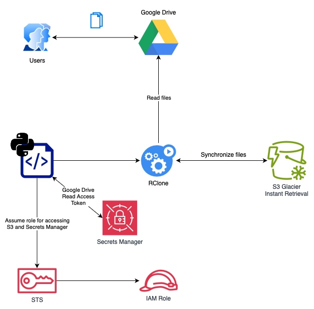

+++
title = "How I automatically backup Google Drive documents to Amazon S3 Glacier IR"
description = "How to automate the backup of Google Drive documents to Amazon S3 Glacier IR using Python and rclone."
date = 2024-11-11
categories = ["Disaster Recovery", "AWS", "Python", "Rclone", "Backup"]
tags = ["disaster-recovery", "aws", "python", "rclone", "backup"]
draft = false
+++

In today’s digital landscape, data backup is crucial for businesses and
individuals alike. My partner and I use Google Drive to store and share our
documents, for things like a scanned copy of our Hotel reservation for an
upcoming trip, along with our dogs’ vaccine certificates. This has been
incredibly useful over the years, specially for offline access, but I do worry
about data loss.

Keeping a secure copy of Google Drive files in Amazon S3 Glacier can add an
extra layer of protection, especially for critical documents. This guide
outlines a simple automated process that I implemented to sync Google Drive
with Amazon S3 (Glacier Instant Retrieval) using Python and
[rclone](https://github.com/rclone/rclone). This setup allows for an automated
backup solution that runs on a cron schedule, making data backups a breeze.

OK, let’s get into it…

## Project Overview



A simple Python script orchestrates the setup configuration and credential
retrieval, then runs rclone, which performs it’s synchronization between
Google Drive and S3 Bucket. For added convenience, the entire operation is
scheduled to run as a GitHub workflow, ensuring regular backups with minimal
user intervention, but we can circle back to that.

## Key Components

 **RClone reads from Google Drive** :
[rclone](https://rclone.org/drive/) is the core of this solution. For this use
case, I configured it to access Google Drive with `drive.readonly`
[permission](https://rclone.org/drive/#drive-readonly) to grant read-only
access to all the files. The rclone scopes are mapped to [Google Drive API scopes](https://developers.google.com/drive/api/guides/api-specific-auth).

 **RClone stores into S3 Storage (Instant Retrieval class)** :
The [S3 Glacier storage class family](https://aws.amazon.com/s3/storage-classes/glacier/)
is ideal for long-lived data archiving with minimal read
access, making it low-cost option. I am choosing to use
[S3 Glacier Instant Retrieval](https://aws.amazon.com/s3/storage-classes/glacier/instant-retrieval/)
(IR) because it gives me the option to retrieve millisecond
retrievals, albeit at a higher retrieval API call cost.
[S3 Pricing link](https://aws.amazon.com/s3/pricing/) for full details.

S3 Standard — storage cost: $0.023 per GB — GET per 1k requests: $0.0004
S3 Glacier IR — storage cost: $0.004 per GB — GET per 1k requests: $0.01

The assumption here is that we are using S3 as a redundancy, and we really
don’t need to retrieve data except for testing and in case Google Drive
account is unavailable for any reason.

 **Scheduled Workflow (optional, but recommended)** :
By setting up a scheduled job, the backup process automatically runs at
predefined intervals, ensuring your data remains up-to-date in S3 without
manual oversight. To keep it simple and minimize the cost, I chose Github
Actions to do this, but you can just as easily run it on your laptop.

## Step-by-Step Guide

1\. Install RClone

To get started, download and [install rclone](https://rclone.org/install/).

2\. Set up Google Drive access

In a terminal prompt run:

```
rclone config

```
Follow the on-screen prompts to set up access to your Google Drive. Ensure you
grant only `drive.readonly` permissions to limit access strictly to reading
files, which reduces chances for security incident and accidental writes.

The `~/.rclone.conf` generated will add a block similar to this, where
`GDrive` is the name I chose,

```
[GDrive]
type = drive
scope = drive.readonly
token = {"access_token": "abcd1234",
          "token_type":"Bearer",
          "refresh_token": "wxyz9876",
          "expiry":"2024-11-09T19:21:34.729137-04:00"}

```
2\. Set up S3 access

You’ll need an AWS account with IAM and S3 access. I also recommend enabling
object versioning as an additional safety measure.

Use `rclone config` to add AWS S3 as a remote storage option. rclone will
guide you through the options like object owner and storage class.

For the credentials, it’s best practice to not have static IAM credentials so
leverage `env_auth` with AWS STS to assume identity with temporary
credentials.

Once done, the `~/.rclone.conf` will add a block similar to this, where
`AWSS3` is the name I chose,

```
[AWSS3]
type = s3
provider = AWS
region = us-east-1
env_auth = true
acl = private
storage_class = GLACIER_IR
bucket_acl = private

```
3\. Test it out!

At this point, we should be able to test out the synchronization process to
see what would happen.

We can run a dry-run with to sync all documents in your Google Drive to the
`sync` prefix in your bucket.

```
rclone sync --dry-run GDrive: AWSS3:bucket-name/sync/

```
Bonus points for setting up a cron job to do this on a schedule.

## The argument for a Python orchestrator

While this is not necessary if you are simply running this locally, but I
wanted to make this repeatable in Github Actions, while storing the Google API
tokens in AWS Secrets Manager.

As an overview, the Github Actions is authorized with OIDC to get temporary
credentials to access S3 and Secrets Manager. The Python script uses these
credentials to fetch the Google API token then dynamically generates the
`rclone.conf` , which allows Github Actions to execute the `rclone sync`
command. Finally the python script takes the refreshed Google API token and
stores it back in the Secrets Manager.

## Final Thoughts

Using this setup, I can simplify my data backup routine by leveraging the
power of `rclone`, GitHub Actions, and the reliability of AWS S3. Not only
does this save time, but it also creates a dependable safety net for my data.

 _Full code is available on my_[ _Github
repository_](https://github.com/weirdion/backup-gdrive-s3) _. If you have
improvement suggestions, feel free to reach out on_[
_LinkedIn_](https://www.linkedin.com/in/ankitpatterson/) _or open a Github
issue!_

— —

 _I’m trying to get better about writing about things I do. Let me know if you
found this useful_ 🙂 _._

 _Connect with me on_ [_LinkedIn_](https://www.linkedin.com/in/ankitpatterson/) _._
