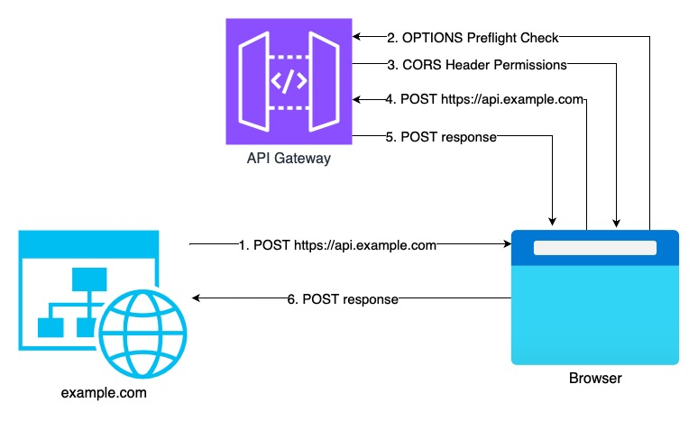

+++
title = "When CORS Requests Turn Into Unexpected API Gateway Costs (and How to Fix It)"
description = "CORS preflight requests can silently double your AWS API Gateway costs. Learn why this happens and practical strategies to optimize architecture, caching, and routing to cut costs."
summary = "Cross-Origin Resource Sharing (CORS) can result in hidden AWS API Gateway charges when every request triggers a preflight. This post explains why and shows how to use CloudFront, caching, path-based routing, and smart API design to reduce costs."
categories = ["AWS", "Serverless", "Cloud Architecture", "Cost Optimization", "API Gateway"]
tags = ["cors", "api-gateway", "aws", "serverless", "cloud-cost-optimization", "cloudfront", "architecture", "caching", "api-design"]
feature = "featured.jpg"
date = 2025-01-15
layout = "simple"
draft = false
+++

So you've built this awesome website hosted on `example.com`, and it needs to talk to your super cool API running on `api.example.com` through API Gateway. Simple enough, right? Well, not so fast! Enter CORS (Cross-Origin Resource Sharing), the bouncer at the API club that needs to check everyone's ID twice.

## The CORS Dance 🕺



Let's break down what actually happens when your website makes a request:

* Your website at `example.com` wants to make a POST request to your API at `api.example.com`.

```javascript
fetch('https://api.example.com/data', {
  method: 'POST',
  headers: {
    'Content-Type': 'application/json',
    'Authorization': 'Bearer token123'
  },
  body: JSON.stringify({ message: 'Hello API!' })
});
```

* Browser: "Hold up! Different domain? This is a cross-origin request with custom headers. Time for a preflight check!"

* The browser automatically sends an OPTIONS request

```
OPTIONS /data HTTP/1.1
Host: api.example.com
Origin: https://example.com
Access-Control-Request-Method: POST
Access-Control-Request-Headers: Content-Type, Authorization
```

* API Gateway: "Here are my CORS header permission slips"

```
HTTP/1.1 200 OK
Access-Control-Allow-Origin: https://example.com
Access-Control-Allow-Methods: POST, GET, OPTIONS
Access-Control-Allow-Headers: Content-Type, Authorization
Access-Control-Max-Age: 300
```

* Browser: "Cool, this looks all good. Now I can make the actual POST request!"

* Browser sends the actual request

## Why This Matters 💰

Here's the kicker - in this dance, you've made TWO API Gateway requests:

1. The OPTIONS preflight request

2. The actual POST request

And guess what? You're billed for both!

Now multiply this by thousands of requests per day, and you'll see why optimizing your CORS setup is crucial. 

Say your website makes 10,000 POST requests /minute, and each request triggers an OPTIONS preflight request.

```
Actual POST requests per month =
  10,000 requests/minute
  * 60 minutes/hour
  * 24 hours/day
  * 30 days/month
  = 432,000,000 requests/month

Total with preflight requests =
  432,000,000 * 2
  = 864,000,000 requests/month
```


## Better Approaches

First, let's understand what triggers these CORS requests. A cross-origin request happens when you make any of these calls:

* A different domain (for example, from `example.com` to `myotherfancydomain.com`)

* A different sub-domain (for example, from `example.com` to `store.example.com`)

* A different port (for example, from `example.com:443` to `example.com:1234`)

* A different protocol (for example, from `https://example.com` to `http://example.com`)

Each of these triggers those pesky preflight requests, this is also outlined in [AWS Docs - API Gateway CORS Request Types].

So here's how to handle them smartly:

### 1. The CloudFront Combo

Use CloudFront as a unified distribution point for both your frontend and API. CloudFront can route requests to different origins while maintaining the same domain for your users.

### 2. The Smart Caching Strategy

Configure your CORS headers with a longer max-age - within reason, ofcourse. This tells browsers to cache the preflight response:

```json
// API Gateway response headers
{
  "Access-Control-Allow-Origin": "https://example.com",
  "Access-Control-Allow-Methods": "GET,POST,PUT,DELETE",
  "Access-Control-Allow-Headers": "Content-Type,Authorization",
  "Access-Control-Max-Age": "3600"  // Cache for an hour!
}
```

### 3. Path-based Routing Strategy

This involves consolidating multiple services into path-based routing under a single domain, maintaining service separation while eliminating CORS issues.

Before (with CORS issues):
```
// Frontend
https://app.example.com

// APIs on different subdomains
https://api.example.com/users
https://store.example.com/products
https://auth.example.com/login

// Each requires CORS and triggers preflight requests!
```

After (Path-based Routing):

```
// Frontend
https://example.com/app

// Services consolidated under paths
https://example.com/api/users
https://example.com/store/products
https://example.com/auth/login
```

No CORS needed, but you can still route these internally to different services using API Gateway.

```json
// API Gateway routing configuration
{
  "/api/*": {
    "target": "http://internal-api-service:8080"
  },
  "/store/*": {
    "target": "http://internal-store-service:3000"
  },
  "/auth/*": {
    "target": "http://internal-auth-service:4000"
  }
}
```

### 4. Grouping your API calls

If CORS is unavoidable, another way to lower your costs can be to group your API calls to reduce the number of cross-origin requests. Instead of making five separate calls, bundle them into one!

For example, instead of:

```
GET /user/profile
GET /user/preferences
GET /user/notifications
```

Use:

```
GET /user/dashboard (returns all three in one response)
```

This way, you're dealing with one preflight request instead of three!

## Helpful Tips

While CORS is necessary security, you don't want to pay twice for every request you make. By implementing these strategies, you can keep your API secure while keeping those AWS bills slim.

Monitoring Tip: Keep an on your API Gateway metrics to track those OPTIONS requests. If they're taking up a significant portion of your total requests, it might be time to implement one of these solutions.

## Further Reading

* [Mozilla - Cross-Origin Resource Sharing (CORS)](https://developer.mozilla.org/en-US/docs/Web/HTTP/CORS)
* [AWS Docs - What is Cross-Origin Resource Sharing?](https://aws.amazon.com/what-is/cross-origin-resource-sharing/)
* [AWS Docs - API Gateway CORS Request Types]

---

 Feedback is always welcome!

[AWS Docs - API Gateway CORS Request Types]: <https://docs.aws.amazon.com/apigateway/latest/developerguide/how-to-cors.html#apigateway-cors-request-types>
