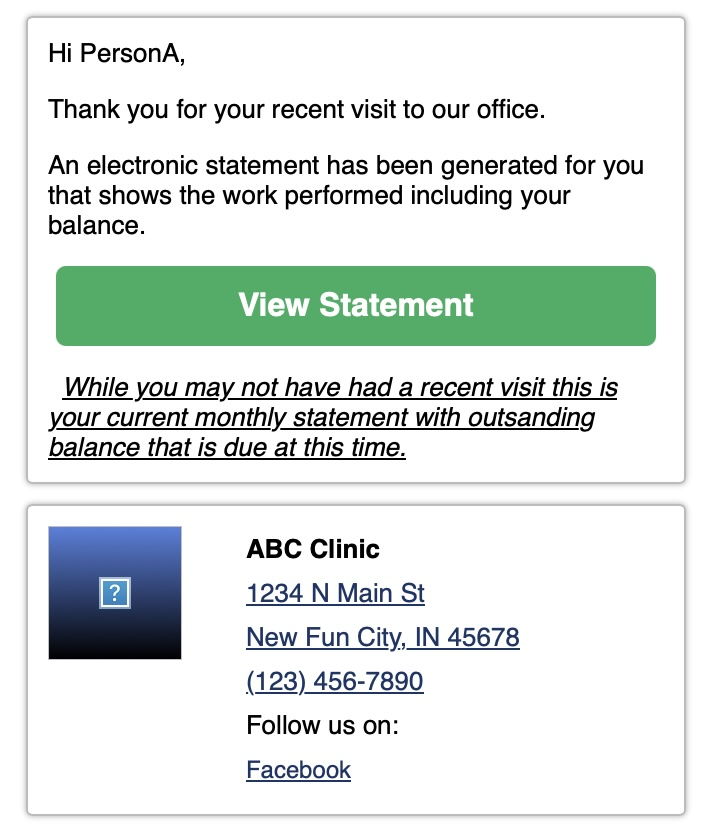

+++
title = "5 Business Email Mistakes That Hurt Security and Trust (And How to Fix Them)"
description = "Misconfigured business emails damage deliverability, reduce customer trust, and expose organizations to phishing risks. Learn the 5 common mistakes and how to prevent them."
summary = "Your business emails might look legitimate, but simple misconfigurations can make them appear suspicious, land in spam, or even enable phishing attacks. Here are the top 5 mistakes companies make with email security — and how to fix them."
categories = ["Email Security", "Business", "Deliverability", "Compliance"]
tags = ["email-security", "deliverability", "dmarc", "dkim", "spf", "business-email", "trust", "phishing-prevention", "compliance"]
feature = "featured.jpg"
date = 2025-03-11
layout = "simple"
draft = false
+++

As a longtime customer of a business I appreciate, I recently received an email from them that raised several security concerns. While the message itself was legitimate, certain issues made it look unprofessional and even suspicious. These types of problems can harm a business' reputation, reduce email deliverability, and even put customers at risk.

If your business relies on email communication, here are some key security issues to watch out for - and how to fix them before they hurt your business.

## What did the email look like?

### Headers

```
From: ABC Clinic <notifications@randomservice.com>
To: customer@example.com
Subject: Your Electronic Statement
Message-ID: <123456@@email.amazonses.com>
Authentication-Results:
       dkim=pass header.i=@amazonses.com
       spf=pass
       dmarc=fail (p=NONE sp=NONE dis=NONE) header.from=randomservice.com
```
Headers have been trimmed to highlight the key parts for the blog.

### Content



## Why is this bad?

### 1. Unrecognized or Unbranded Sender Address

📧 `FROM: ABC Clinic <notifications@randomservice.com>`

#### Why this is a problem:

* The email is coming from `randomservice.com` instead of the business’s actual domain.
* This looks **less professional** and can confuse recipients.
* Customers may ignore or **mark emails as spam** if they don’t recognize the sender’s domain.

#### ✅ Fix:

* Use a custom email address that matches your business’s domain (e.g., `@abcclinic.com`).
* If using a third-party email service, configure **DKIM and SPF records** so emails appear as if they’re coming from your domain.

### 2. DKIM signed by a different domain

🔍 `dkim=pass header.i=@amazonses.com`

#### Why this is a problem:
* DKIM (DomainKeys Identified Mail) helps verify email authenticity.
* If DKIM is signed by a different domain (`amazonses.com` instead of `abcclinic.com`), some email providers **flag the message as suspicious**.
* This **reduces email deliverability**, meaning important emails may end up in spam.

#### ✅ Fix:

* Set up **DKIM authentication** so emails are signed by your business’s domain.
* Work with your email service provider to ensure proper alignment between your DKIM signature and your sender domain.

### 3. DMARC failures

⚠️ `dmarc=fail (p=NONE sp=NONE dis=NONE)`

#### Why this is a problem:

* DMARC (Domain-based Message Authentication, Reporting & Conformance) helps prevent email spoofing.
* A failure means the email **isn’t properly authenticated** as coming from your domain.
* Many email providers **reject or flag** emails that fail DMARC.
* **Worst case:** Scammers could impersonate your business and send phishing emails.

#### ✅ Fix:

* Publish a **DMARC policy** for your domain (`p=none`, `p=quarantine`, or `p=reject`).
* Use DMARC reports to monitor email authentication and adjust settings accordingly.

### 4. Missing Unsubscribe Option

📌 **Best Practice:** Always include an easy way for recipients to opt out of future emails.

#### Why this is a problem:

* In the U.S., the [CAN-SPAM Act](https://www.ftc.gov/business-guidance/resources/can-spam-act-compliance-guide-business) requires marketing emails to include an unsubscribe option.
* Emails without an unsubscribe link may be marked as spam, **hurting your sender reputation**.
* ISPs (like Gmail, Outlook, and Yahoo) might **block future emails** from your domain.
* Violations of CAN-SPAM Act can have monetary and/or legal consequences.

#### ✅ Fix:

Every email should include:
* **Company name & physical address** (PO Box is acceptable in some regions).
* A clear opt-out method, such as:
  * A **one-click unsubscribe** link
  * A **reply-to unsubscribe** option (e.g., “Reply with ‘UNSUBSCRIBE’ to opt out”).

FTC Compliance Guide: [CAN-SPAM Act](https://www.ftc.gov/business-guidance/resources/can-spam-act-compliance-guide-business)

### 5. Mismatch or Suspicious Links

🔗 Email link: `https://short.link/XYZ123`
➡ Redirects to: `https://billingportal.differentProvider.com`

#### Why this is a problem:

* The visible link (`short.link`) **doesn’t clearly indicate** where it leads.
* When clicked, it redirects to a completely different domain.
* Shortened or unfamiliar links **can appear suspicious**, leading recipients to hesitate before clicking.
* Some email security filters **flag or block emails** with mismatched links, reducing deliverability.

#### ✅ Fix:

* Use a domain that clearly reflects the final destination, such as `billing.abcclinic.com`.
* If redirection is necessary, inform users upfront (e.g., “You will be redirected to our secure payment portal at example.com”).

## Final Thoughts

Email security issues can make even legitimate businesses look untrustworthy. By taking steps to authenticate emails, align sender domains, and ensure compliance with best practices, you can improve email deliverability and maintain customer trust.

If your business relies on email for communication, now is a great time to review your settings and make any necessary adjustments. A few small changes can go a long way in ensuring your emails reach your customers — and don’t end up in spam!
