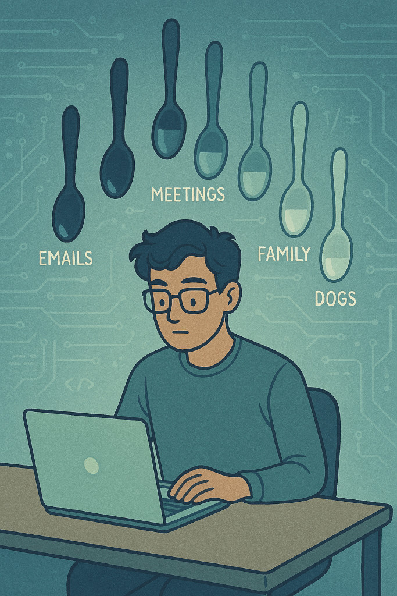

+++
title = "Managing Mental Energy in Tech with Spoon Theory: Avoiding Burnout"
description = "A practical guide to applying Spoon Theory to manage mental energy, reduce burnout, and set healthy boundaries while working in tech."
summary = "Tech culture demands constant output, but our mental energy is finite. Learn how Spoon Theory helps developers and engineers manage spoons, avoid burnout, and build sustainable careers."
categories = ["Mental Health", "Productivity", "Work-Life Balance", "Tech Culture", "Burnout"]
tags = ["mental-health", "burnout", "remote-work", "tech-industry", "productivity", "spoon-theory", "work-life-balance", "boundaries", "wellness"]
feature = "featured.jpg"
date = 2025-04-04
layout = "simple"
draft = false
+++

If you work in the world of tech, you probably know the feeling: deadlines pile up,
Slack messages keep coming, and somewhere in the chaos, you are supposed to find time
for yourself and grow.

Originally developed by [Christine Miserandino in 2003](https://butyoudontlooksick.com/articles/written-by-christine/the-spoon-theory/),
Spoon Theory describes how limited physical or mental energy affects daily life.
I think it applies just as much to mental health, especially in high-pressure environments like tech.

## The Invisible Drain: A Thought Experiment

Imagine you have 12 spoons in your hands. Every meaningful action you take - getting out of bed, answering emails and slack messages, debugging code - requires you to give up a spoon. Some tasks cost more spoons than expected, draining your mental energy faster. You don't get them back until you rest and recover.

Now, imagine your co-workers  don't see these spoons. They think you have the same mental energy as they do and keep asking you for more. You feel pressure to push through, even though you know you're running on empty. Where does more spoons to fill the gap come from? You borrow from your personal life and give it to your work instead. That's the invisible drain.

## The Hidden Costs

The tech industry demands a lot of mental energy, and many of those energy drains go unseen or unacknowledged.

### Context Switching

Modern tech workflows is all about being asynchronous, it demands we juggle multiple responsibilities at once - jumping from feature development to bug triage, from stand-ups to incident reviews, all the while getting Slack notifications that interrupt your train of thought.

Each switch breaks your focus and requires you to mentally reboot. It may seem minor, but switching contexts repeatedly adds cognitive overhead that depletes your focus and drains your spoons faster than you think.

### Imposter Syndrome
Tech moves fast, and the sense of never knowing enough is common. That can fuel a persistent sense of being an imposter - even when you're producing excellent work.

The constant internal questioning eats away at your confidence and adds emotional weight to each task. It's exhausting pretending to be confident when you're quietly doubting every line of code you write.

### Perfectionism & Debugging Fatigue

There's always something more to optimize; a cleaner function, better test coverage, more elegant architecture. And when bugs arise, the pressure to fix them quickly - without introducing new issues - can become overwhelming.

These tasks don't just require time, they demand sustained focus and emotional investment. Debugging especially often turns into a spiral of frustration, draining your patience and spoons along the way.

### Always-On Culture with Working from Home

One of the most important spoon-saving advantages in my life is working from home. I don't take it for granted. If I had to commute - fighting traffic or cramming into public transport - it would cost me 2–3 spoons before the workday even began. That's a significant tradeoff.

Working from home means I can use those spoons more meaningfully. When I feel stressed, or feel my energy dipping from heads-down tasks, I can walk away for five minutes. Not to scroll my phone or check more emails, but to say hi to my partner, rub my dogs' bellies or throw a frisbee or ball for my dogs. Just few minutes of warm smiles and wagging tails lets me reset my brain and be more productive.

But there's a downside too. The same flexibility that allows for mid-day resets can lead to blurred boundaries. Without a clear start and end provided by commuting, it's easy to slip into an "always-on" mode - checking messages first thing in the morning or after hours, jumping back into code late at night, or feeling guilty for stepping away during the day. It's a a hidden cost that builds up and quietly drains spoons over time.

### Bad Management

One of the most consistent and frustrating sources of spoon drain can be ineffective or unsupportive managers. A bad manager might ignore workload boundaries, micromanage, or push unrealistic timelines without regard for mental bandwidth. Even well-meaning but unaware managers can accidentally demand more spoons that you have to give.

Being managed by someone who doesn't understand mental energy limitations - or worse, doesn't care - can turn even enjoyable work into a source of stress and depletion.

## Managing Your Spoons

We are not one-dimensional characters whose sole purpose is to build and ship projects. We have real lives we care about, families we love, friends we need to connect with, and personal projects we want to explore. Managing your spoons means making space for all of that.

### 1. Prioritize And Protect Your Spoons

  - Identify which tasks drain you the most and plan accordingly
  - Automate repetitive work where possible (scripts, AI tools, etc.)
  - Use a task manager app to track things you need to get done, tagging them with categories like Personal, Home, Dog Stuff, and Work.
  - Assign priorities to your tasks, I use the [Eisenhower Matrix](https://www.eisenhower.me/eisenhower-matrix/) to do this.

### 2. Set Boundaries
   - Set a time and notification limit for your work apps on your phone, I use [Focus for iOS](https://support.apple.com/guide/iphone/set-up-a-focus-iphd6288a67f/ios)
   - Say no to unnecessary meetings and context switching
   - Limit notifications and set focus hours to get important work done
   - Review and manage your tasks for the next day in the evening, ensuring you don't overload or overplan. The goal isn't to schedule everything, but to make space for things that truly matter across all facets of life.

### 3. Recharge Intentionally
   - Take real breaks - step outside, touch some grass (like a friend of mine likes to say), walk your dogs
   - Spend time with loved ones (like my wife and partner, who reminds me work isn't everything)

### 4. **Talk About It**
   - Normalize discussions about mental energy in tech spaces
   - Give others a break, you might not see how many spoons they have had drained already today.
   - If you manage a team, be mindful that not everyone has the same spoon count each day

## Wrapping Up

In tech, where the demand for mental effort is relentless, understanding our limits is crucial for long-term sustainability. Whether you're coding, managing, or just trying to survive another sprint, remember: **your spoons matter**.

If you haven't read it, I highly recommend reading the original [Spoon Theory by Christine Miserandino](https://butyoudontlooksick.com/articles/written-by-christine/the-spoon-theory/).
