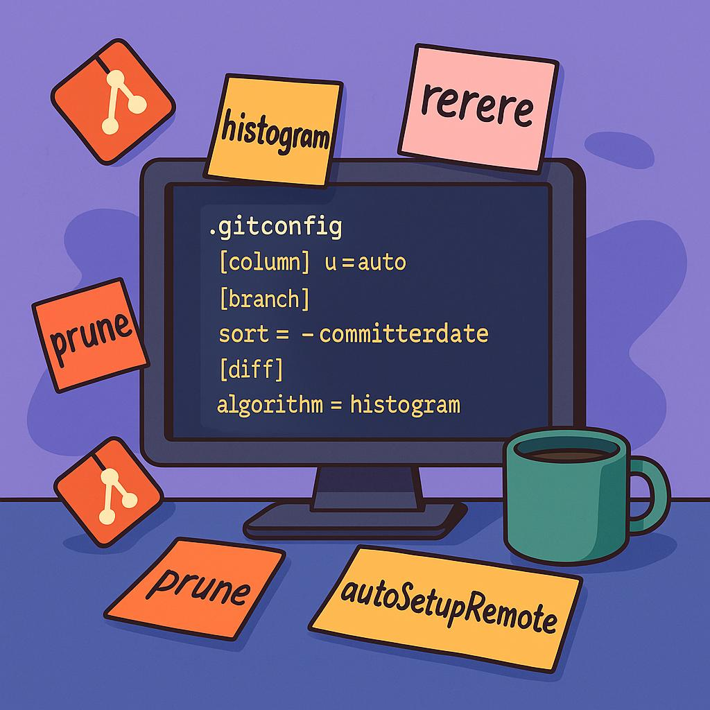

+++
title = "Optimizing Your Git Config: My Developer Setup"
description = "A guide to customizing your Git configuration for a cleaner workflow, smarter diffs, and reduced cognitive load."
date = 2025-04-12
categories = ["git", "developer-tools", "productivity", "github"]
tags = ["git", "git-config", "developer-setup", "productivity", "workflow", "version-control"]
layout = "simple"
draft = false
+++

I’ve been a developer for a while now, and I’m still surprised by how many folks stick with Git’s default setup. Sure, the defaults are sensible — they need to be, to work for as many workflows as possible. But they’re also generic by design, and there’s a lot of value in making Git work _your_ way.

**Why does customizing Git Config matter?**

- Real-world dev work benefits from opinionated setup
- Sane defaults =/= optimal settings — defaults aren’t tailored for team workflows, modern branching strategies, or personal preferences



## The Basics

This is the part that most people already do when they first install git on their system.

```bash
git config --global user.name "Your Name"  
git config --global user.email "your.name@example.com"
```

**Bonus points:** Use a dedicated email address for your public commits to protect your personal email.

The next step up,

- Default branch naming — main instead of master for new repositories
- Default editor of choice — this is what will open when you are writing commit messages or resolving conflicts in terminal

```bash
# default branch naming  
git config --global init.defaultBranch main  
  
# default editor  
git config --global core.editor vim  
# alternate option for people who prefer to do this in vscode ui  
git config --global core.editor "code --wait"
```

Small thing of note before we get to the fun stuff,

- `--global` is used to set the configuration default for all your repositories, this stores the options in `~/.gitconfig`
- If you use `git config user.email “work@example.com”` inside your project’s repository directory, this is stored within `your_repository/.git/config`

When you run any of the commands, the commands are stored like this —

```ini
[user]  
    name = Your Name  
    email = your.email@example.com  
[init]  
    defaultBranch = main  
[core]  
    editor = vim
```

This is more copy-paste friendly, so I’m going to use this for the rest of the article.

# Making Workflow Improvements

If you are just here for copy-paste solution, here is the consolidated improvements.

```ini
[column]  
    ui = auto  
  
[branch]  
    sort = -committerdate  
  
[tag]  
    sort = version:refname  
  
[help]  
    autocorrect = prompt  
  
[commit]  
    verbose = true  
  
[pull]  
    rebase = true  
  
[push]  
    default = simple  
    autoSetupRemote = true  
    followTags = true  
  
[fetch]  
    prune = true  
    pruneTags = true  
  
[diff]  
    algorithm = histogram  
    colorMoved = zebra  
    mnemonicPrefix = true  
    renames = true  
  
[rerere]  
    enabled = true  
    autoupdate = true
```

Now, let’s break down these options,

# Cleaner interface

```ini
[column]  
    ui = auto  
[branch]  
    sort = -committerdate  
[tag]  
    sort = version:refname
```

🔄 **Before**

```bash
> git branch  
  
  bug/fix-login  
  docs/add-api-guide  
  feature/add-logs  
  feature/auth-ui  
  feature/code-cleanup  
  hotfix/prod-patch  
  release/1.0  
  release/1.1  
  wip/debug-mode
```

🐛 Sorted alphabetically. No indication of activity or recency. Vertical wall of text.

```bash
> git tag  
  
  v1.10.0  
  v1.2.0  
  v1.1.0  
  v2.0.0
```

🐛 Sorted alphabetically. Harder to track release progression.

✅ **After**

```bash
> git branch  
  feature/auth-ui        hotfix/prod-patch       release/1.1  
  wip/debug-mode         feature/add-logs        release/1.0  
  feature/code-cleanup   bug/fix-login           docs/add-api-guide
```
🎯 Active branches float to the top  
🧠 Easier to find what you were just working on

```bash
> git tag  
v1.1.0  
v1.2.0  
v1.10.0  
v2.0.0
```
🧮 Sorted by version awareness  
📋 Clean progression of releases

# CLI Help & Commit Context

```ini
[help]  
    autocorrect = prompt  
[commit]  
    verbose = true
```

🔄 **Before**

```bash
> git cmomit  
git: 'cmomit' is not a git command.
```
🐛 Wasted time. You feel like a typo monster.

```bash
> git commit  
  
Your commit message here  
# Please enter the commit message for your changes. Lines starting  
# with '#' will be ignored, and an empty message aborts the commit.  
#  
# On branch main  
# Changes to be committed:  
#	modified:   example.py  
#
```
🐛 Minimal context. Higher chance to include things you didn’t mean to commit.

✅ **After**

```bash
> git cmomit  
Did you mean 'commit'? [Y/n]
```
💡 Built-in help with forgiving UX  
🙌 Fast recovery from typos

```bash
> git commit  
  
Your commit message here  
# Please enter the commit message for your changes. Lines starting  
# with '#' will be ignored, and an empty message aborts the commit.  
#  
# On branch main  
# Changes to be committed:  
#	modified:   example.py  
#  
# ------------------------ >8 ------------------------  
# Do not modify or remove the line above.  
# Everything below it will be ignored.  
diff --git c/example.py i/example.py  
index 2e857e2..600a3a7 100644  
--- c/example.py  
+++ i/example.py  
@@ -8,7 +8,10 @@ def greet_user(name):  
...
```
💭 Immediate context, letting you write better messages  
🧠 Fewer mistakes

# Pull & History Cleanliness

```ini
[pull]  
    rebase = true
```

**🔄 Before**

```bash
> git pull  
Merge made by the 'recursive' strategy.  
  
*   abc123 Merge branch 'main' into feature/new-logic  
|\  
| * def456 Updated README  
|/  
*   789abc Your commit
```

🐛 Extra commits. Tangled history. Harder rebases later.

**✅ After**

```bash
> git pull  
Successfully rebased and updated refs/heads/feature/new-logic.  
  
* def456 Updated README  
* 789abc Your commit
```

🧼 No unnecessary merge commits. Straight commit line.  
✨ Better collaboration

# Push, Fetch & Sync

```ini
[push]  
    default = simple  
    autoSetupRemote = true  
    followTags = true  
[fetch]  
    prune = true  
    pruneTags = true
```

🔄 **Before**

```bash
feature/new-logic > git push  
fatal: The current branch feature/new-logic has no upstream branch.  
To push the current branch and set the remote as upstream, use:  
  
    git push --set-upstream origin feature/new-logic
```

🐛 Extra command line to track and set up upstream branches.

```bash
feature/new-logic > git tag v3.0.0  
feature/new-logic > git push
```
🐛 Tag doesn’t go to remote.

```bash
> git fetch  
> git branch -r  
origin/feature/active-login  
origin/feature/old-auth     👈 still here!  
origin/main
```
🐛 Remote branches linger. Manual cleanup of local branches required.

**✅ After**

```bash
feature/new-logic > git push  
Pushing to origin feature/new-logic
```
🚀 Push “just works”. Remote is set up automatically.

```bash
feature/new-logic > git tag v3.0.0  
feature/new-logic > git push
```
📦 Tags sync automatically. Better release hygiene.

```bash
> git fetch  
Pruning obsolete remote-tracking branch 'origin/feature/old-auth'  

> git branch -r  
origin/feature/active-login  
origin/main
```
🌿 Stale branches removed automatically. One less thing to remember.

# Smarter Diffs & Visual Clarity

```ini
[diff]  
    algorithm = histogram  
    colorMoved = zebra  
    mnemonicPrefix = true  
    renames = true
```
🔄 **Before**

```bash
> git diff  
--- a/users.py  
+++ b/users.py  
@@ def process_users(users):  
-    log.info("Processing users")  
     for u in users:  
         process(u)  
+    log.info("Done processing users")
```
🐛 Looks like straight delete + add, not that line was moved. a/b file prefixes don’t help.

```bash
> git diff --name-status  
D       oldfile.py  
A       newfile.py
```
🐛 Missing intent of file movement. Looks like unrelated changes.

**✅ After**

```bash
> git diff  
--- c/users.py  
+++ w/users.py  
@@ def process_users(users):  
-    log.info("Processing users")  
     for u in users:  
         process(u)  
+    log.info("Done processing users")
```
🧠 `c/` = committed, and `w/` = working — better mental tracking model  
📦 histogram keeps structure intact for easier scanning of functional changes

```
R100    oldfile.py → newfile.py
```
🪄Git knows it’s the same file, and has been moved. Helps with blame/history.

# The magical rerere

```ini
[rerere]  
    enabled = true  
    autoupdate = true
```

**🔄 Before**

```bash
> git rebase main  
  
<<<<<<< HEAD  
enable_feature = False  
=======  
enable_feature = True  
>>>>>>> main
```
🐛 You manually fix it, even if it happens on different branches or across multiple rebases.

**✅ After**

```bash
> git rebase main  
  
Recorded preimage for 'example.py'  
Resolved 'example.py' using previous resolution.  
  
> git status  
  
All conflicts fixed but you are still merging.  
(use "git commit" to conclude merge)
```
🧠 Git remembers your fix.  
⚡ Conflict resolved instantly. You get to keep your flow.

# Wrapping Up

Git’s defaults are designed to be safe and broad — but not necessarily _optimal_. By tweaking just a few settings, we’ve turned Git into a sharper, more responsive tool that better matches the way we actually work as mid-to-senior developers:

✅ Cleaner history  
✅ Smarter diffs  
✅ Less conflict overhead  
✅ Less cognitive load  
✅ More “just works” behavior

These aren’t flashy changes — they’re quiet productivity boosters. You might only notice their absence once you’ve had a taste of working with them.

This post didn’t even touch **git aliases** (which deserve their own spotlight), but the takeaway is simple: Git is deeply customizable, and a few thoughtful tweaks can make your daily development life noticeably smoother.

If you have any favorite Git config settings I didn’t cover, I’d love to hear them. Or if you’re curious about how to craft a legendary `.gitconfig` alias section, stay tuned for part two. 👀

Happy committing! ✨
