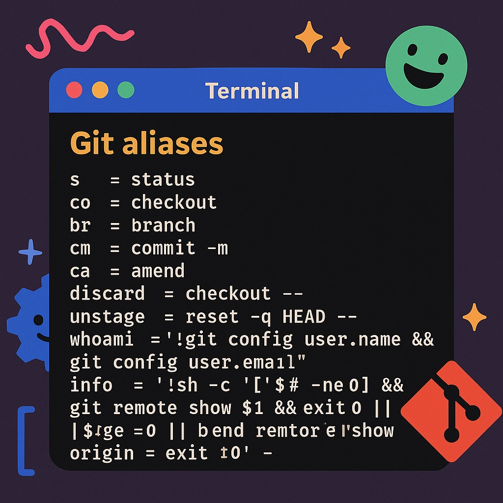

+++
title = "Git Aliases for Developers: 25+ Time-Saving Shortcuts for Your Workflow"
description = "Boost your Git productivity with 25+ powerful aliases. Learn essential shortcuts, workflow boosters, and power tools that save developers hours every week."
date = 2025-04-21
categories = ["git", "developer-tools", "productivity", "github"]
tags = ["git", "git-config", "developer-setup", "productivity", "workflow", "version-control"]
draft = false
canonical = "https://weirdion.github.io/posts/2025-04-21-supercharging-your-git-aliases-my-developer-setup/"
+++

In my previous post — Optimizing Your Git Config: My Developer Setup, I talked about tuning Git’s
behavior through `.gitconfig`. Now it’s time to take that a step further — by teaching Git your
personal shorthand.

Git aliases are one of the simplest ways to make your workflow faster, smoother, and less
repetitive. Think of them like custom keybindings — but for Git.



## 🧩 The Case for Aliases

We all type git status dozens of times a day. Multiply that across a week or a year and you are
burning time on keystrokes. Aliases fix that. They also reduce friction around those
slightly-too-long commands we should run more often, but avoid out of laziness (like
`git log —graph —oneline`).

These are the Git aliases I actually use — grouped by category — with some real-world scenarios
to show you how they help.

And as always, if you want to grab-and-go, copy-paste away my friends.

```ini
[alias]
    # Essential Shorthands
    s = status                  # Show working tree status
    co = checkout               # Switch branches or restore files
    br = branch                 # List, create, or delete branches
    brs = branches              # List all local and remote branches
    branches = branch -a        # List all local and remote branches
    c = commit                  # Regular commit
    cm = commit -m              # Commit with inline message
    ca = amend                  # Amend the last commit
    can = amend --no-edit       # Amend the last commit with no message edit
    amend = commit --amend      # Amend the last commit

    # Workflow Boosters
    grepl = grep -E --line-number   # Search repo with regex and line numbers
    discard = checkout --           # Discard local changes to a file
    untrack = rm --cached           # Remove file from version control but keep it locally
    abort = rebase --abort          # Abort an in-progress rebase
    uncommit = reset --soft HEAD^   # Undo last commit but keep changes staged
    unstage = reset -q HEAD --      # Remove file from staging area
    showRef = show-ref --abbrev     # Show refs in abbreviated format
    peeps = shortlog -n -e -s       # List contributors by number of commits
    # List all defined aliases
    aliases = "!git config -l | grep alias | cut -c 7-"
    # Simple one-liner commit graph
    lo = log --graph --decorate --pretty=oneline --abbrev-commit

    # Power Tools
    # Print current Git identity
    whoami = "!git config user.name && git config user.email"
    # Show remote info (defaults to origin)
    info = "!sh -c '[ $# -ne 0 ] && git remote show $1 && exit 0 || \
        [ $# -eq 0 ] && git remote show origin && exit 0' -"
    # Colorful log with author and relative date
    logPretty = log --graph --pretty=format:'%Cred%h%Creset -%C(yellow)%d%Creset \
        %s %Cgreen(%cr) %C(bold blue)<%an>%Creset' --abbrev-commit --date=relative
    # Count lines of code per author
    peepsLoC = "!git ls-files | xargs -n1 git blame --line-porcelain | sed \
        -n 's/^author //p' | sort -f | uniq -ic | sort -nr"
    # File & Branch Helpers
    find = "!git ls-files | grep -i" # Search files tracked by git (case-insensitive)
    # Visualize difference between two branches
    diffBranches = "!f() { echo \"Showing ${1}..${2}\"; git log --graph \
        --pretty=format:'%Cred%h%Creset -%C(yellow)%d%Creset  %s %Cgreen(%cr)%Creset' \
        --abbrev-commit --date=relative \"$1\"..\"$2\"; }; f"
```

Now, let’s get into the weeds.

## 🔡 Essential Shorthands

Save keystrokes on the stuff you type all the time. And yes, you can use your git aliases in
other aliases.

```ini
[alias]
    s = status                  # Show working tree status
    co = checkout               # Switch branches or restore files
    br = branch                 # List, create, or delete branches
    brs = branches              # Shortcut to 'branches' (all branches)
    branches = branch -a        # List all local and remote branches
    c = commit                  # Regular commit
    cm = commit -m              # Commit with inline message
    ca = amend                  # Shortcut to 'amend'
    can = amend --no-edit       # Amend the last commit, no message edit
    amend = commit --amend      # Amend the last commit
```

**🔄 Before**

```bash
git status
git checkout -b feature/signup
git branch
git branch -a
git commit -m "Fix typo"
```

**✅ After**

```bash
git s
git co -b feature/signup
git br
git brs
git cm "Fix typo"
git ca 
```

🎯 Save time on high-frequency commands without thinking.

## 🛠 Workflow Boosters

#### 🧪 Grep

```bash
grepl = grep -E --line-number
```

You are in project, and want to track down where the generate_report function is defined or used.

```bash
❯ git grepl "generate_report"

reports/generator.py:12:def generate_report(data):
tests/test_generator.py:4:from reports.generator import generate_report
tests/test_generator.py:15:    result = generate_report(mock_data)
```

📍Just like that, you’ve found the definition and all the usages across your project.

#### 🗑 Discard Changes

```bash
discard = checkout --
```

You made some changes and realize... nope, not it. Time to wipe them.

```bash
❯ git status
	modified:   main.py

❯ git discard main.py

❯ git status
	nothing to commit, working tree clean
```

📍Untracks the file without removing it locally. Git forgets it, you keep it.

#### 🧹 Un-Stage a File

```bash
unstage = reset -q HEAD --
```

You've staged something that you didn’t mean to. Time to clean it up.

```bash
❯ git add script.py
❯ git status
	Changes to be committed:
		modified: script.py

❯ git unstage script.py
❯ git status
	Changes not staged for commit:
		modified: script.py
```

📍Quickly pull files back out of staging, no drama.

#### 🛑 Abort a Rebase

```bash
abort = rebase --abort
```

You tried to rebase, but things went south. Let’s back out gracefully.

```bash
❯ git rebase main
(conflicts occur...)
❯ git abort
```

📍Instant escape hatch from a tangled rebase.

#### 🔙 Un-Commit (Keep the Changes)

```bash
uncommit = reset --soft HEAD^
```

You committed too soon, maybe forgot to update something. This walks it back, but keeps your
work in staging.

```bash
❯ git uncommit
❯ git status
On branch dev
Your branch is up to date with 'origin/dev'.

Changes to be committed:
  (use "git restore --staged <file>..." to unstage)
	modified:   script.py
```

📍Soft reset = undo commit, keep all staged changes.

#### 🕵️ Show Git References

```bash
showRef = show-ref --abbrev
```

Need to check what refs exist behind the scenes?

```bash
❯ git showRef
e1a3f1a refs/heads/main
a21d1c4 refs/tags/v1.0
```

📍Useful for CI pipelines or debugging detached HEAD states.

#### 👥 Contributor Summary

```bash
peeps = shortlog -n -e -s
```

Check who's the active maintainers are:

```bash
❯ git peeps
  104  Ankit Dev <ankit.dev@example.com>
   56  Coder Dev <coder.dev@example.com>
```

📍Fast, clean view of commit contributors.

## 🔧 Power Tools

#### 🙋 Who Am I?

```bash
whoami = "!git config user.name && git config user.email"
```

Working across many repos or using different Git identities?

```bash
❯ git whoami
Ankit Dev
ankit.dev@example.com
```

📍Helps avoid those “why did I just push as work account to personal repo” moments.

#### 🌐 Show Remote Info

```bash
info = "!sh -c '[ $# -ne 0 ] && git remote show $1 && exit 0 || \
      [ $# -eq 0 ] && git remote show origin && exit 0' -"
```

Need to know where origin points or details about a specific remote?

```bash
❯ git info
* remote origin
  Fetch URL: git@github.com:weirdion/my-repo.git
  Push  URL: git@github.com:weirdion/my-repo.git
  HEAD branch: main
```

📍Smart default to origin, but handles any remote passed as arg.

#### 📊 Visual Log: One-liner Graph

```bash
lo = log --graph --decorate --pretty=oneline --abbrev-commit
```

You want the big picture from the git log, fast.

```bash
❯ git lo
* f7b2dce - Merge pull request #45 (HEAD -> main)
* 83b12a7 - Fix tests
* 3ab89ec - Add report module
*   c0829ce Merge pull request #44 from weirdion/add-config-dir
|\
| * 87e983f Add config script
|/
* 0f27cb9 Clean up misc stuff
```

📍Clean, color-coded, quick overview of commit history.

#### 🎨 Visual Log: Author & Time

```bash
logPretty = log --graph --pretty=format:'%Cred%h%Creset -%C(yellow)%d%Creset \
      %s %Cgreen(%cr) %C(bold blue)<%an>%Creset' --abbrev-commit --date=relative
```

When you want richer context — who wrote what, when, and you want it to be pretty.

```bash
❯ git logPretty
* f7b2dce - (HEAD -> main, origin/main) Merge PR #45 (2 hours ago) <Ankit Dev>
* 83b12a7 - Fix broken tests (5 hours ago) <Coder Dev>
```

📍Great for reviews or context on active branches.

#### 🧠 Lines of Code by Author

```bash
peepsLoC = "!git ls-files | xargs -n1 git blame --line-porcelain | sed \
      -n 's/^author //p' | sort -f | uniq -ic | sort -nr"
```

Who’s writing the code? Not just committing.

```bash
❯ git peepsLoC
1340 Ankit Dev
 962 Coder Dev
```

📍Dig deeper than commit counts — see who owns the codebase.

#### 🔎 Find Tracked Files

```bash
find = "!git ls-files | grep -i"
```

Find any file in the repo — even in deep sub-directories — case-insensitively.

```bash
❯ git find config
src/app/config.py
tests/test_config.py
```

📍Faster than scrolling or find ..

#### 🌲 Diff Between Branches

```bash
diffBranches = "!f() { echo \"Showing ${1}..${2}\"; git log --graph \
--pretty=format:'%Cred%h%Creset -%C(yellow)%d%Creset  %s %Cgreen(%cr)%Creset' \
--abbrev-commit --date=relative \"$1\"..\"$2\"; }; f"
```

Quick visual of what one branch has that the other doesn’t.

```bash
❯ git diffBranches main feature/reporting
Showing main..feature/reporting
* 8a74f0b - Add report generator (2 days ago)
* 0c1d2f9 - Initial feature setup (3 days ago)
```

📍Perfect for reviews or checking what's left to merge.

## 🏁 Wrapping Up

These aliases aren't meant to reinvent Git — they're meant to unstick you faster and make daily
work feel a little smoother. Think of it as Git with a coat of polish that’s 💯 yours.

If you’re just getting started, copy over a few, and see how you like it. If you’ve already got
a custom config, maybe these sparked a few ideas.

Got favorite aliases of your own? Let me know — I’m always down to steal a good one 😄.

## Frequently Asked Questions

### How do I create custom Git aliases?
Use `git config --global alias.shortname "full command"` or edit your `~/.gitconfig` file directly. Global aliases work across all repositories.

### Can Git aliases call other aliases?
Yes! You can reference other aliases within aliases, making them composable and powerful.

### Are there any risks with Git aliases?
Git aliases are safe and only affect your local Git behavior. They can't damage repositories or data.

### How do I see all my Git aliases?
Use the `aliases` alias from this guide: `git aliases` will list all your configured aliases.

### Can I override default Git commands with aliases?
No, aliases can't override built-in Git commands, but they can provide alternative shortcuts.

## Essential Git Alias Categories

### 1. **Status and Information Aliases**
- `s` = status (most used command)
- `whoami` = show current Git identity
- `info` = show remote information

### 2. **Branch Management Aliases**  
- `br` = branch listing
- `co` = checkout/switch branches
- `brs` = show all branches with activity

### 3. **Commit and History Aliases**
- `cm` = commit with message
- `ca` = amend last commit
- `lo` = one-line commit graph

### 4. **Advanced Workflow Aliases**
- `uncommit` = undo last commit (keep changes)
- `unstage` = remove from staging
- `abort` = abort rebase safely

## Related Git Optimization Guides

Looking to optimize more than just aliases? Check out my comprehensive guide on [Git configuration best practices](/posts/2025-04-12-optimizing-your-git-config-my-developer-setup/) for settings that improve your entire Git workflow.

For infrastructure developers, see how to handle [Git branch divergences](/posts/2025-01-03-understanding-git-divergences/) when working in teams.

## Start Using These Aliases Today

**Copy and paste this complete alias configuration:**

```ini
# Add this to your ~/.gitconfig file
[alias]
    # Essential shortcuts
    s = status
    co = checkout  
    br = branch
    cm = commit -m
    
    # Workflow boosters  
    unstage = reset -q HEAD --
    discard = checkout --
    uncommit = reset --soft HEAD^
    
    # Power tools
    whoami = "!git config user.name && git config user.email"
    lo = log --graph --decorate --pretty=oneline --abbrev-commit
    aliases = "!git config -l | grep alias | cut -c 7-"
```

**Next steps:**
1. **Add these aliases** to your `.gitconfig`
2. **Practice the shortcuts** in your next project  
3. **Customize further** based on your workflow
4. **Share with your team** to standardize productivity

Connect with me on [LinkedIn](https://www.linkedin.com/in/ankitpatterson/) to share your favorite Git aliases!
