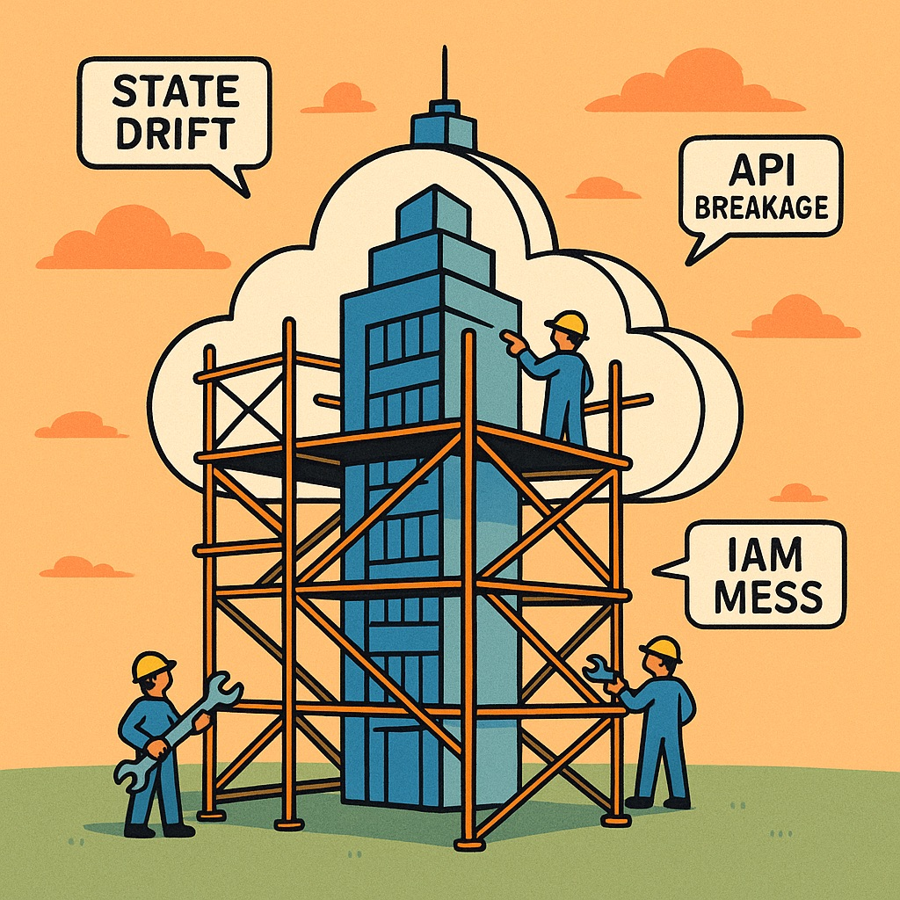

+++
title = "Why Infrastructure as Code Feels Broken in 2025"
description = "Discover why Infrastructure as Code tools like Terraform, CDK, and Pulumi still feel fragile and complex, plus solutions for better IaC workflows."
date = 2025-07-01
categories = ["Infrastructure", "AWS", "Cloud", "DevOps"]
tags = ["iac", "aws", "cdk", "terraform", "pulumi", "cloud", "devops", "multi-cloud", "state-management"]
draft = false
canonical = "https://weirdion.github.io/posts/2025-07-01-why-does-iac-feels-broken-in-2025/"
+++

<!-- Schema.org structured data -->
<script type="application/ld+json">
{
  "@context": "https://schema.org",
  "@type": "Article",
  "headline": "Why Infrastructure as Code Feels Broken in 2025",
  "description": "Discover why Infrastructure as Code tools like Terraform, CDK, and Pulumi still feel fragile and complex, plus solutions for better IaC workflows.",
  "image": "https://weirdion.github.io/assets/images/2025-07-01-why-does-iac-feels-broken-in-2025.jpg",
  "author": {
    "@type": "Person",
    "name": "Ankit Patterson"
  },
  "datePublished": "2025-07-01",
  "mainEntityOfPage": "@id"
}
</script>

I’ve worked with infrastructure in one form or another for years now — from click-ops to CDK, Pulumi, and Terraform. The tooling has definitely evolved, but so has the complexity. And lately, I’ve found myself asking a frustrating question more and more often:

**Why does infrastructure as code still feel so… brittle?**

We have more tools than ever. And yet, getting a clean, reliable, and collaborative setup across teams still takes effort, workarounds, and too much time fiddling with low-level quirks. I’m not trying to be cynical or trying to dunk on any one tool. But as an engineer, I can’t shake the feeling that our current abstractions are reaching their limits.




## **🚧 The Friction in Today’s Tooling**

We’re not short on options. What we’re short on is composability, predictability, and confidence. Below are the pain points that show up again and again in real-world infrastructure work.

### **🌥️ The False Promise of Multi-Cloud**

Every provider has its own quirks, service limits, and naming inconsistencies. Even the simplest concept — like a “bucket” — behaves differently across AWS, GCP, and Azure.

Tools like Terraform or Pulumi claim multi-cloud support, but under the hood they’re often just stitching together individual provider SDKs. The abstraction is shallow. Try modeling advanced IAM conditions or network boundaries generically — you’ll quickly find yourself writing:

```
if (cloud === 'aws') {
  // do X
} else if (cloud === 'gcp') {
  // do Y
}
```

That’s not abstraction — it’s conditional logic.

**The result?** Codebases become brittle, hard to test, and difficult to scale across environments.

### **🗃️ State Management Is Still Fragile**

Remote state is powerful — and also a pain.

With Terraform, you’re setting up resources like S3 buckets, DB for locks, IAM roles to access them. Pulumi simplifies some of that… but unless you self-host, you’re locked into their cloud state backend.

Even CDK, which feels more native to developers, just compiles down to CloudFormation stacks. So you inherit CloudFormation’s limitations — like slow deploys, drift detection weirdness, and nested stack complexity.

**State is both essential and fragile**. And almost every real-world team I’ve worked with has had to fight it.

### **🧱 You Can’t Escape the Bootstrap**

Even with the best tooling, there’s always a chicken-and-egg problem:

> **_Where does your infrastructure state live… before you have infrastructure?_**

That means pre-creating resources to store, access and manage the state. And yes, there are managed “Cloud” services, so you either accept vendor lock-in or you self-host, and accept the issues as reasonable cost.

It’s a quiet contradiction: **you can’t fully do infrastructure-as-code, because your infrastructure needs somewhere to store its code state first**.

Some teams hack around this with shell scripts, Terraform “bootstrap” folders, or even click-ops buckets with README instructions. But it breaks the illusion of pure declarative infrastructure — and becomes one more thing to track, and for disaster recovery, it’s another thing that’s a big blip on the radar.

### **🧪 Testing and Validation (or… Governance?)**

Testing infrastructure code goes well beyond “does this syntax work?” — it’s about ensuring that what you deploy matches what you intended: least privilege, encrypted data, proper network boundaries, etc.

But that’s still hard.

- **Unit tests** via CDK assertions, Pulumi mocks, or kitchen-terraform often **validate structure, not intent**.
    
- **Policy tools** like OPA (Rego), Checkov bolt on compliance enforcement, but feel external — and often trigger late in the CI/CD pipeline.
    

#### **👔 Governance as a workaround**

Many larger teams try to codify best practices as reusable building blocks, usually wrapped in higher-level abstractions:

- **CDK Level 3 constructs**: Opinionated patterns that bundle multiple resources with sane defaults (e.g., a secure S3 bucket with logging, encryption, and versioning).
    
- **Pulumi Best Practices Library**: Attempting to encode common security and compliance expectations into standard building blocks.
    
- **Terraform Modules:** Often wrapped internally with pre-set variables and guardrails to prevent insecure defaults.
    

These efforts help **reduce footguns**, but they don’t remove complexity — they just relocate it. And there’s often a silent tension between flexibility and safety.

Tooling vendors try to walk a fine line: offering **low-level control** for power users, while promoting **higher-level abstractions** that bake in best practices. But in practice, the higher-level constructs are often **unknown or underused**by those writing day-to-day infrastructure — either due to lack of awareness, discoverability, or confidence in how opinionated those abstractions are.

And so we circle back — teams still end up writing raw IAM policies, managing subnets manually, and re-solving solved problems, one YAML file at a time.

### **🧨 SDK Drift & Provider Upgrades Are Risky**

Cloud providers move fast — new features, new constraints, new behaviors.

Your IaC tool’s SDK or plugin has to catch up. Sometimes that takes weeks. And when you _do_ upgrade, your once-working stack might break.

- CDK’s construct libraries go stale if your team doesn’t stay on top of things.
    
- Pulumi relies on upstream SDKs, so lag is common.
    
- Terraform providers have notorious upgrade issues — even minor bumps.
    

Infra code becomes a moving target. Not because your system changed — but because the **tooling around it did**.

### **🐢 The Feedback Loop Is Way Too Slow**

Here’s the usual cycle:

1. Write Code
    
2. Plan ( `cdk synth` / `terraform plan` / `pulumi preview` )
    
3. Deploy
    
4. Wait
    
5. Realize something’s wrong
    
6. Try to roll back
    
7. Re-plan
    

Even if you’re using preview features or dry runs, you can’t see the impact of a change (latency, throughput, IAM restrictions, quotas) until after you’ve applied it.

- **CDK** generates Cloudformation templates ( `cdk synth` ), but you are still at the mercy of CF’s slow deploys and rollback behavior.
    
- **Pulumi** adds `pulumi preview` , but the preview doesn’t always reflect what cloud providers will actually do at deploy time.
    
- **Terraform** gives you a `terraform plan`, but it won’t catch everything like runtime errors, API limits.
    

In all cases, you often don’t find out something’s broken until after a real deploy:

- A bucket name conflict
    
- An API rate limit hit
    
- A security misconfiguration
    
- A resource being “in use” or in the wrong state
    

Even when the tooling gives you a preview, it rarely gives you **real-world feedback** about performance, latency, or cost — until you hit “deploy” and find out the hard way. With app code, tests and previews are instant. With infra code, it **often feels like guessing**.

*** End of venting, thanks for making it this far. ***

## **🧠 Why This Keeps Happening**

Here’s the hard truth: most tools treat “infrastructure as code” as a **string templating problem**. You describe a desired state, and they generate the right JSON or YAML under the hood.

Tools like **Ansible** offered a kind of promise: _idempotent infrastructure_ by inspecting actual system state before applying changes. If a user was already created, a package already installed, or a file already present, Ansible wouldn’t touch it. You could rely on “what I asked for is what I get” — at least on a single machine.

But infrastructure in the cloud world, that guarantee breaks down for a few reasons:

- You can’t always see the full state
    
- Eventual consistency is everywhere
    
- Side effects, defaults, and hidden dependencies
    
- The API Isn’t the whole story
    
- The Cloud is too big to model easily
    

That’s too much to meaningfully wrap in a single syntax — and that’s where the abstraction starts to leak.

### **So Why Can’t IaC Just Be Better?**

Because it’s fighting an uphill battle. Unlike traditional config management, IaC operates in an opaque, distributed, multi-actor system:

- You don’t control the OS
    
- You don’t always get strong guarantees
    
- You don’t see all the dependencies
    
- You can’t always retry safely
    
- And the tooling often assumes you know more than you do
    

We’re asking tools to pretend infrastructure is deterministic when it often isn’t.

## **🛤 So Where Do We Go From Here?**

I don’t have a perfect answer. But I do think we’re overdue for a rethink.

What would a better system look like?

- **Composability:** Infra should be versioned and shared like code — without fighting registries or packaging quirks.
    
- **First-class policy:** Tools like OPA or Rego should be part of the IaC pipeline, not bolt-ons.
    
- **Infra-aware preview:** Show me what a change really does — not just a plan output.
    
- **Simulation environments:** Like test containers, but for cloud.
    
- **Multi-cloud-native design:** Not wrapper libraries, but shared core abstractions that degrade gracefully.
    

In short: let’s build infrastructure tooling that understands infrastructure better.

I’m not here to trash the tools. Every one of them — CDK, Pulumi, Terraform — has helped me ship real systems. But I’ve also spent countless hours fighting their edges, debugging provider mismatches, or trying to reverse a bad deploy.

If you’ve been there too — I see you.

Maybe the next era of infrastructure isn’t just “more tools,” but **better ones**, built with empathy for the people who live in these trenches every day.
