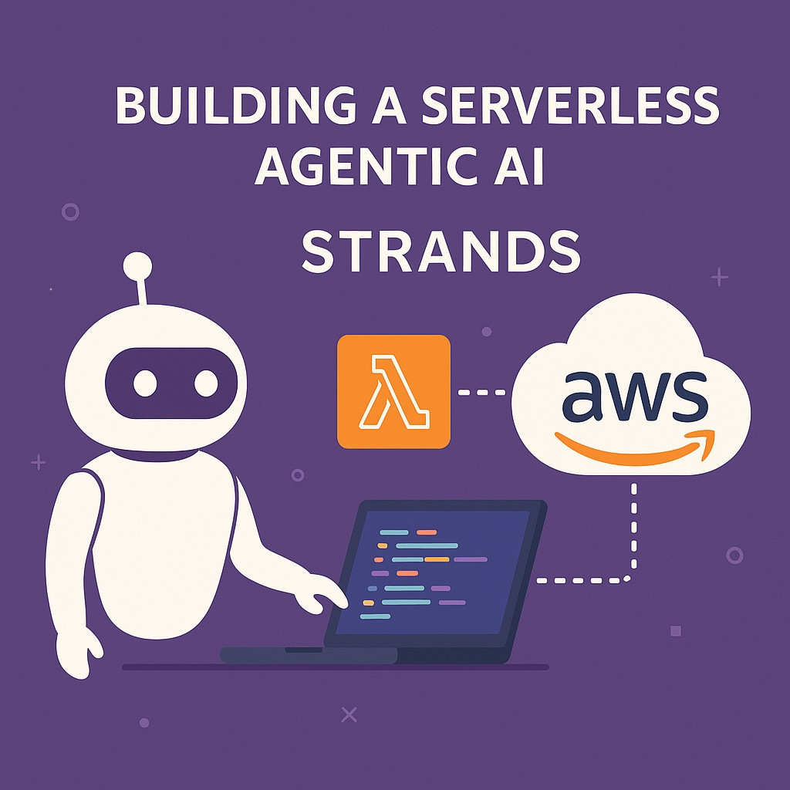

+++
title = "Building a Serverless Agentic AI on AWS with Strands SDK"
description = "Step-by-step guide to building and deploying a scalable serverless agentic AI REST API using AWS Strands SDK, Amazon Bedrock, Lambda, and CDK."
summary = "Learn how to deploy a production-ready serverless AI agent on AWS using the Strands SDK with Lambda, API Gateway, Bedrock, and CDK. Includes architecture, code, and cost breakdown."
date = 2025-07-16
categories = ["AWS", "Serverless", "AI Agents", "Agentic AI", "Infrastructure as Code", "Cloud"]
tags = ["strands-sdk", "aws-lambda", "api-gateway", "amazon-bedrock", "claude", "python", "typescript", "cdk", "serverless-ai", "lambda-layers"]
feature = "featured.jpg"
layout = "simple"
draft = false
+++

**_Disclaimer:_** _I work at AWS, but this is a weekend project to test out the new sdk._

As a developer, there’s one thing I keep bumping into: all the hyped, cool proof-of-concept demos and not enough actually useful, actionable examples. I love a good AI demo as much as anyone, but most of them stop just short of being something you’d actually ship. I wanted something I could drop into a real project, not just a hackathon.

So here’s my simple example to deploy a REST API that invokes an agentic AI to reason and act — without the overhead.



### What is Strands?

[Strands SDK](https://strandsagents.com/latest/) is a new open-source SDK released by AWS to build and run AI agents. But it doesn’t stop there, you can build workflows, integrate with MCP, add personas — locally or in prod. It sounded pretty cool, so why not play with it!

Simple PoC?

```
Python 3.13.2 (main, Mar 12 2025, 17:47:59) on darwin
Type "help", "copyright", "credits" or "license" for more information.

>>> from strands import Agent
>>> agent = Agent(model="us.anthropic.claude-3-7-sonnet-20250219-v1:0")
>>> agent.model.config
{'model_id': 'us.anthropic.claude-3-7-sonnet-20250219-v1:0'}

>>> response = agent("Hello!")
Hello there! How can I assist you today? I'm here to help with any questions
or tasks you might have.

>>> response
AgentResult(stop_reason='end_turn', message={'role': 
'assistant', 'content': [{'text': "Hello there! How can I assist you today?
I'm here to help with any questions or tasks you might have."}]}, 
metrics=EventLoopMetrics(cycle_count=2, tool_metrics={}, 
cycle_durations=[0.9638030529022217], 
traces=[<strands.telemetry.metrics.Trace object at 0x115acde80>, 
<strands.telemetry.metrics.Trace object at 0x115ae2210>], 
accumulated_usage={'inputTokens': 11, 'outputTokens': 27, 'totalTokens': 38},
accumulated_metrics={'latencyMs': 930}), state={})
```

Now, Strands has a lot more to offer, but this should show you a basic example on how easy it is to interact with any model of your choosing.

Also worth noting, it looks like calling `agent("Hello")` seems to print sysout, in the current version (1.0.0), even when the structured `AgentResult` was successfully added to response object. This is because the [default Callback Handler](https://strandsagents.com/latest/documentation/docs/user-guide/concepts/streaming/callback-handlers/#default-callback-handler) is `PrintingCallbackHandler` which prints all the text as it’s streamed. To disable that, simply set it to `None`.

Ok, now let’s get this deployed into an API.

If you just need the code: [http://github.com/weirdion/strands-agent-example](http://github.com/weirdion/strands-agent-example)

### The Approach: Serverless, Layered, and Maintainable

Here’s what worked for me:

- Python for the AI logic — the ecosystem is unbeatable
    
- AWS Lambda + API Gateway for serverless REST API
    
- Lambda Layers to keep deployment package lean and mean
    
- AWS CDK (Typescript) for the infrastructure as code
    

Before diving into the code, I’m going to assume you know you’re way around CDK and Poetry — it might be worth a quick search.

#### Starting Project Structure

```
.
├── app/                # Python Lambda source
│   ├── agent.py        # Business logic to interact with the AI model(s)
│   └── main.py         # Lambda handler
├── lambda/layer/       # Lambda Layer for Python dependencies (built via Poetry/Makefile)
├── lib/                # CDK TypeScript stack (API Gateway, Lambda, Layer)
├── bin/                # CDK entrypoint
├── test/               # CDK/infra tests
├── pyproject.toml      # Poetry project config for lambda dependencies
├── package.json        # Node/TypeScript project config for CDK
├── Makefile            # Setup, build, lint, and layer automation
└── ...
```

#### IaC at a high level

The [Lambda Layer](https://docs.aws.amazon.com/lambda/latest/dg/chapter-layers.html) is all of our python dependencies wrapped into one folder that can be re-used across multiple Lambdas. It is created from the Makefile using the command:

```
layer:
    rm -rf lambda/layer/python
    mkdir -p lambda/layer/python
    poetry export --only main -f requirements.txt --without-hashes | \
        pip install -r /dev/stdin -t lambda/layer/python
```

Then deployed in the CDK stack using:

```typescript
const pythonStrandsLayer = new LayerVersion(this, 'StrandsPythonLayer', {
  code: Code.fromAsset('lambda/layer'),
  compatibleRuntimes: [Runtime.PYTHON_3_12, Runtime.PYTHON_3_13],
  description: 'Python dependencies for Strands Agent Example',
  removalPolicy: cdk.RemovalPolicy.DESTROY,
});
```

The Lambda and API Gateway are pretty straightforward CDK as well, except that we want to allow the lambda to be able to invoke the model of your choice:

```typescript
// lambda function
const apiLambda = new Function(this, 'StrandsAgentExampleLambda', {
  runtime: Runtime.PYTHON_3_13,
  code: Code.fromAsset('app'),
  handler: 'main.handler',
  timeout: cdk.Duration.seconds(30),
  layers: [pythonStrandsLayer],
  logGroup: new LogGroup(this, 'StrandsAgentExampleLambdaLogGroup', {
    logGroupName: `/aws/lambda/${this.stackName}-StrandsAgentExampleLambda`,
    removalPolicy: RemovalPolicy.DESTROY,
    retention: RetentionDays.ONE_WEEK,
  }),
});

// allow lambda to access the model
apiLambda.addToRolePolicy(new PolicyStatement({
  actions: [
    'bedrock:InvokeModelWithResponseStream',
  ],
  resources: [
    `arn:aws:bedrock:${cdk.Stack.of(this).region}:${cdk.Stack.of(this).account}:inference-profile/us.anthropic.claude-3-7-sonnet-20250219-v1:0`,
    `arn:aws:bedrock:*::foundation-model/anthropic.claude-3-7-sonnet-20250219-v1:0`,
  ],
}));

// api gateway
const api = new LambdaRestApi(this, 'StrandsAgentExampleApi', {
  handler: apiLambda,
  proxy: false,
  deployOptions: {
    stageName: 'v1',
  },
  description: 'API for Strands Agent Example'
});
const items = api.root.addResource('invoke');
  items.addMethod('POST', new LambdaIntegration(apiLambda), {
    apiKeyRequired: false,  // ONLY for example - FIX THIS IN PROD
});
```

Worth noting here, **_the foundation model triggered is not in the same region as your stack_.** During the runtime, I found my lambda switching between us-east-1 and us-east-2 for the foundation model.

And yes, I know left the `apiKeyRequired: false`. Next phase after making this work is to integrate with Cognito and replace auth with JWT tokens.

#### Lambda Handler

The lambda handler simply acts as a pass-through to validate the incoming request, and passes it to `agent.py` .

```python
from dataclasses import dataclass

from agent import invoke_agent
from aws_lambda_powertools import Logger
from aws_lambda_powertools.event_handler import APIGatewayRestResolver
from aws_lambda_powertools.event_handler.exceptions import BadRequestError
from aws_lambda_powertools.logging import correlation_paths
from aws_lambda_powertools.utilities.typing import LambdaContext
from pydantic import BaseModel

logger = Logger("strands-agent-example")
app = APIGatewayRestResolver(enable_validation=True)


class PromptModel(BaseModel):
    prompt: str


@dataclass
class ResponseModel:
    message: str

    def to_dict(self) -> dict:
        return {"message": self.message}


@dataclass
class ErrorResponseModel:
    error: str
    message: str

    def to_dict(self) -> dict:
        return {"error": self.error, "message": self.message}


@app.post("/invoke")
def call_agent(prompt_model: PromptModel) -> dict:
    """
    Example endpoint that simulates invoking an agent with a prompt.
    """
    prompt = prompt_model.prompt
    logger.info(f"Received prompt: {prompt}")

    try:
        if not prompt.strip():
            raise BadRequestError("Prompt cannot be empty.")
        response = invoke_agent(prompt.strip())
        logger.info(f"Response from agent: {response}")

    except BadRequestError as e:
        logger.error(f"Bad request error: {e}")
        error_response = ErrorResponseModel(error="BadRequest", message=str(e))
        return error_response.to_dict()
    except Exception as e:
        logger.error(f"Error invoking agent: {e}")
        error_response = ErrorResponseModel(
            error="AgentInvocationError", message="Error invoking agent"
        )
        return error_response.to_dict()

    response_model = ResponseModel(message=response)
    return response_model.to_dict()


@logger.inject_lambda_context(correlation_id_path=correlation_paths.API_GATEWAY_HTTP)
def handler(event: dict, context: LambdaContext) -> dict:
    return app.resolve(event, context)
```

**agent.py**

```python
from aws_lambda_powertools import Logger
from strands import Agent

logger = Logger("strands-agent-example")
agent = Agent(
    model="us.anthropic.claude-3-7-sonnet-20250219-v1:0",
    callback_handler=None
)

def invoke_agent(prompt: str) -> str:
    """
    Function to invoke the agent with a given prompt.
    """
    response = agent(prompt)
    logger.info(f"Agent response: {response}")
    return response.message
```

Let’s try triggering the API Gateway now — 

```bash
curl -X POST \
  -H "Content-Type: application/json" \
  -d '{"prompt": "Hello, agent!"}' \
  https://abcd1234.execute-api.us-east-1.amazonaws.com/v1/invoke

{"message":{"role":"assistant","content":[{"text":"Hello! How can I assist 
you today? I'm here to help with any questions or tasks you might have."}]}}
```

Nice, that works.

Now, to customize the agent to be helpful we can simply add a system prompt to give it instructions on how to behave.

```python
agent = Agent(
    model="us.anthropic.claude-3-7-sonnet-20250219-v1:0",
    system_prompt=(
        "You are a helpful assistant, who is knowledgeable about various topics. "
        "Answer the user's questions to the best of your ability. "
        "You're tone should be friendly and informative. "
        "If you don't know the answer, say 'I don't know'. "
        "If the question is not clear, ask for clarification. "
        "If the prompt is only a greeting, you are welcome to be a bit sassy."
    )
)
```

Let’s invoke again,

```bash
curl -X POST -H "Content-Type: application/json" \
-d '{"prompt": "Hello, agent!"}' \
https://abcd1234.execute-api.us-east-1.amazonaws.com/v1/invoke

{"message":{"role":"assistant","content":[{"text":"Hi there! Well, I see 
we're starting with a simple greeting. How very... original!"}]}}
```

We can see the prompt take effect, and the greeting response became ‘sassy’!

#### Adding the ‘Agentic’ part to this AI prompt

Enter ‘tools’ — [https://strandsagents.com/latest/documentation/docs/user-guide/concepts/tools/tools_overview/](https://strandsagents.com/latest/documentation/docs/user-guide/concepts/tools/tools_overview/).

Now there’s a long list of tools that come with [Strands Tools library](https://github.com/strands-agents/tools), and you can add them as easy as — 

```python
from strands import Agent
from strands_tools import calculator, file_read, shell

# Add tools to our agent
agent = Agent(
    tools=[calculator, file_read, shell]
)
```

But I want to create my own tool for this to be useful.

```python
import json

from aws_lambda_powertools import Logger
from strands import tool
from strands.types.tools import ToolResult, ToolResultContent

logger = Logger("strands-agent-example")


@tool(name="check_unraid_health", description="Check the health of the unraid system")
def check_unraid_health() -> ToolResult:
    """
    Function to check the health of the unraid system.
    """
    # Mock call via VPC endpoint to check health of my unraid system at home.
    response = ToolResult(
        toolUseId="unraid-health-check-12345",
        status="success",
        content=[
            ToolResultContent(
                text=json.dumps(
                    [
                        {
                            "drive": "Disk 1",
                            "status": "operational",
                            "temperature": "30C",
                            "errors": 0,
                        },
                        {
                            "drive": "Disk 2",
                            "status": "operational",
                            "temperature": "35C",
                            "errors": 30,
                        },
                    ]
                )
            )
        ],
    )
    logger.info(f"Unraid health check response: {response}")
    return response
```

In this case I have created a mock response for an API call that would return the health status of my Unraid server, let’s add it to the agent — 

```python
from tools import check_unraid_health

agent = Agent(
    model="us.anthropic.claude-3-7-sonnet-20250219-v1:0",
    callback_handler=None,
    tools=[check_unraid_health],
    system_prompt=(
        "You are a helpful assistant, who is knowledgeable about various topics. "
        "Answer the user's questions to the best of your ability. "
        "You're tone should be friendly and informative. "
        "If you don't know the answer, say 'I don't know'. "
        "If the question is not clear, ask for clarification."
    ),
)
```

Ok, one last test — 

```bash
curl -X POST -H "Content-Type: application/json" \
  -d '{"prompt": "How is my unraid system doing?"}' \
  https://abcd1234.execute-api.us-east-1.amazonaws.com/v1/invoke

{"message":{"role":"assistant",
"content":[{"text":"Here's the status of your Unraid system:
\n\n**Disk 1**:\n- Status: Operational\n- Temperature: 30\u00b0C
\n- Errors: None\n\n**Disk 2**:\n- Status: Operational\n- 
Temperature: 35\u00b0C\n- Errors: 30\n\n
Your system appears to be running with both drives operational, 
but I notice Disk 2 has 30 errors reported. While the drive is still 
functioning, these errors could potentially indicate developing issues. 
I'd recommend keeping an eye on Disk 2 and possibly running a SMART test 
or considering a backup of its data. The temperatures for both drives 
are within normal operating ranges."}]}}
```

So not only was the AI able to read the mock API output, it was able to interpret the results and provide a quick recommendation.

Here is the repo for full code — [https://github.com/weirdion/strands-agent-example](https://github.com/weirdion/strands-agent-example)

### 💸 Costs Estimation

Running this stack should be very affordable for most personal and prototype use cases, but here are the main factors:

**Lambda:**

- Pricing — [https://aws.amazon.com/lambda/pricing/](https://aws.amazon.com/lambda/pricing/)
    
- Free tier: 1M requests and 400,000 GB-seconds compute per month.
    
- After free tier: ~$0.20 per 1M requests, plus compute time (depends on memory and duration).
    
- Layers — No extra charge for using Lambda Layers, but you pay for total Lambda storage if you have many versions
    

**API Gateway:**

- Pricing — [https://aws.amazon.com/api-gateway/pricing/](https://aws.amazon.com/api-gateway/pricing/)
    
- Free tier: 1M HTTP API calls per month.
    
- After free tier: ~$1.00 per 1M requests.
    

**Amazon Bedrock Model Inference:**

- Pricing — [https://aws.amazon.com/bedrock/pricing/](https://aws.amazon.com/bedrock/pricing/)
    
- Each API call invokes an Amazon Bedrock model (by default currently in strands —  Sonnet 3.7).
    
- Pricing depends on the model and tokens processed.
    
- As of July 2025, Sonnet 3.7 is ~$0.0030 per 1,000 input tokens and ~$0.0150 per 1,000 output tokens (check the link for current rates).
    

**Example:**

If you run 100,000 invocations per month, each <10s and <512MB, and each prompt/response averages 1,000 tokens in and 1,000 tokens out:

- Lambda and API Gateway: Likely free (within free tier) for most new AWS accounts; after free tier, well under $1/month for typical usage.
    
- Bedrock Sonnet 3.7: ~$0.0030 + $0.0150 = $0.018 per invocation → $1.80 per 100,000 invocations (token usage will vary).
    

_For up-to-date details, always check the official AWS pricing pages._

### Wrapping up

While Strands SDK definitely has a few rough edges, it appears to be a promising library to quickly get an AI prompt, Agentic AI or an AI workflow up and running.

I think the next step is to create a session based separation like how logged in users would interact with it, maybe try to maintain their history and state.

**In the meantime, don’t forget to** `cdk destroy` **your stack once you are done experimenting.**
