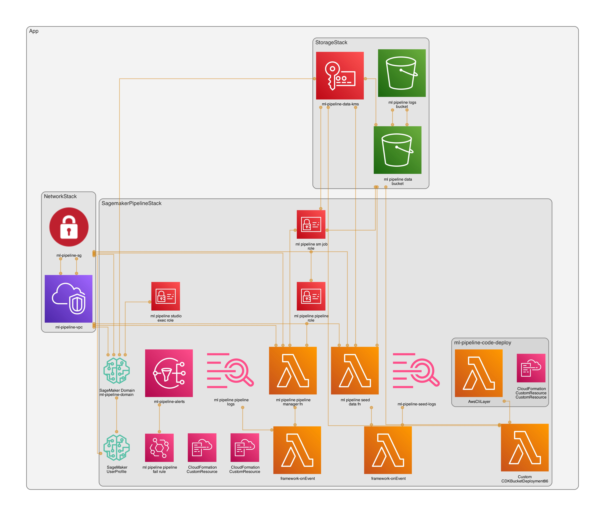
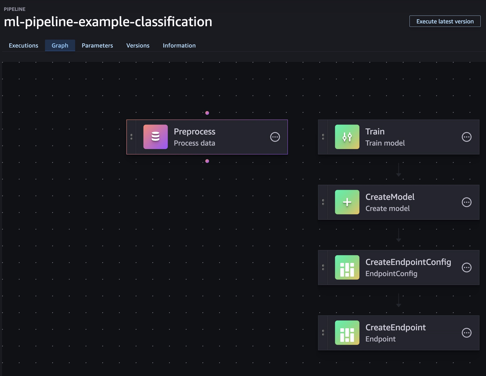

+++
title = "Secure SageMaker Studio + ML Pipelines on AWS with CDK"
description = "A production‑minded example that provisions a secure SageMaker Studio domain and a tabular ML pipeline (processing → training → deploy) using AWS CDK, VPC‑only networking, KMS, and a custom resource for Pipeline lifecycle."
summary = "Deep‑dive build: secure VPC‑only Studio, S3/KMS, endpoints, IAM, and a flexible custom resource that manages SageMaker Pipelines via the SDK — with deploy steps, infra costs, and troubleshooting."
date = 2025-09-15
categories = ["AWS", "SageMaker", "ML", "AI", "Infrastructure as Code", "Cloud", "DevOps", "MLOps", "CDK"]
tags = ["aws", "ai", "ml", "machine-learning", "sagemaker", "studio", "pipelines", "cdk", "vpc", "kms", "lambda", "custom-resource", "autogluon"]
feature = "featured.jpg"
layout = "simple"
draft = false
+++

*Disclaimer: I work at AWS, but this is a personal, technical build guide to create a secure, fully managed ML workflow.*

## Why this post

With the recent advances in AI/ML, I find myself supporting a data science team that are experimenting and building new models, and running inference for classification using AWS Sagemaker AI. The problem? The infrastructure setup for this scope, while establishing a secure environment, is complicated, and made a bit more tricky with limited CDK constructs being available.

I wanted to create a production‑minded example that demonstrates a secure SageMaker Studio deployment with a real ML pipeline — not just screenshots - although, fear not, there are screenshots 😊.

The goals:

- Secure by default: no NAT, private subnets, VPC endpoints, KMS keys.
- Minimal and reproducible: TypeScript CDK, small Lambdas, few moving parts.
- Practical: preprocessing, training, and real‑time inference using [AutoGluon](https://github.com/autogluon/autogluon).
- Flexible pipeline lifecycle: managed via a custom resource (SDK) instead of touchy L1.

## Architecture at a glance



- VPC‑only networking (no NAT)
  - Isolated subnets
  - Gateway endpoint: S3
  - Interface endpoints: SageMaker API/Runtime/Studio, ECR API/DKR, CloudWatch Logs, STS
- Encryption
  - KMS CMKs with rotation for data (S3), logs (CloudWatch), and Studio storage
- Storage
  - Single data bucket with prefixes: `raw/`, `processed/`, `models/`
  - Separate access logging bucket
- SageMaker Studio
  - IAM auth, VPC‑only
  - One user profile: `weirdion`
- ML Pipelines
  - Preprocessing (split CSV), Training (AutoGluon), CreateModel, EndpointConfig, Endpoint
  - Pipeline lifecycle via Lambda custom resource using the SageMaker SDK
- Observability
  - EventBridge rule → SNS topic for pipeline failure notifications

### Stacks

- `NetworkStack` — VPC, endpoints, Security Group
- `StorageStack` — KMS data key, data bucket, access logs bucket
- `SagemakerPipelineStack` — Studio domain/user, IAM roles, data seed Lambda CR, pipeline manager Lambda CR, failure alarms

## The Fun Part

As always, if you just need the code - https://github.com/weirdion/sagemaker-pipeline-example


### VPC and Endpoints

We don't want/need egress for this sandbox, so everything will go through endpoints.

**NOTE**: Endpoints cost money, be sure to factor that in - [AWS Private Link Pricing](https://aws.amazon.com/privatelink/pricing/).

```typescript
// lib/network-stack.ts (excerpt)
this.vpc = new Vpc(this, `${props.projectPrefix}-vpc`, {
  maxAzs: 2,
  natGateways: 0,
  subnetConfiguration: [{ name: 'private-isolated', subnetType: SubnetType.PRIVATE_ISOLATED }],
});
this.vpc.addGatewayEndpoint(`${props.projectPrefix}-s3-endpoint`, { service: GatewayVpcEndpointAwsService.S3 });
for (const [name, service] of [
  ['ecr-dkr', InterfaceVpcEndpointAwsService.ECR_DOCKER],
  ['ecr-api', InterfaceVpcEndpointAwsService.ECR],
  ['logs', InterfaceVpcEndpointAwsService.CLOUDWATCH_LOGS],
  ['sts', InterfaceVpcEndpointAwsService.STS],
  ['sagemaker-api', InterfaceVpcEndpointAwsService.SAGEMAKER_API],
  ['sagemaker-runtime', InterfaceVpcEndpointAwsService.SAGEMAKER_RUNTIME],
  ['sagemaker-studio', InterfaceVpcEndpointAwsService.SAGEMAKER_STUDIO],
] as const) {
  this.vpc.addInterfaceEndpoint(`${props.projectPrefix}-${name}-endpoint`, { service, privateDnsEnabled: true });
}
```

### Storage

Nothing fancy here, but for completeness, I set a data bucket encrypted with KMS, along with access logging bucket.


```typescript
// lib/storage-stack.ts (excerpt)
this.dataKey = new Key(this, `${ props.projectPrefix }-data-kms`, {
  alias: `${ props.projectPrefix }/data`,
  enableKeyRotation: true,
  description: 'CMK for S3 data encryption',
});
this.logsBucket = new Bucket(this, `${ props.projectPrefix }-logs-bucket`, {
  bucketName: PhysicalName.GENERATE_IF_NEEDED,
  blockPublicAccess: BlockPublicAccess.BLOCK_ALL,
  encryption: BucketEncryption.S3_MANAGED,
  enforceSSL: true,
  removalPolicy: RemovalPolicy.DESTROY, // for PoC; RETAIN for prod
  autoDeleteObjects: true, // for PoC; false for prod
  objectOwnership: ObjectOwnership.BUCKET_OWNER_ENFORCED,
});

this.dataBucket = new Bucket(this, `${ props.projectPrefix }-data-bucket`, {
  bucketName: PhysicalName.GENERATE_IF_NEEDED,
  blockPublicAccess: BlockPublicAccess.BLOCK_ALL,
  encryption: BucketEncryption.KMS,
  encryptionKey: this.dataKey,
  enforceSSL: true,
  serverAccessLogsBucket: this.logsBucket,
  serverAccessLogsPrefix: 's3-access-logs/',
  removalPolicy: RemovalPolicy.DESTROY, // for PoC; RETAIN for prod
  autoDeleteObjects: true, // for PoC; false for prod
  objectOwnership: ObjectOwnership.BUCKET_OWNER_ENFORCED,
});
```

### Sagemaker

Now that we are in the world of ML, it's worth knowing that AWS publishing public ECR images for a variety of models that can be re-used. For this example, I used autogluon for training and inference, and scikit-learn for pre-processing.

- Github repository - https://github.com/aws/deep-learning-containers/tree/master
- AWS Docs List - https://docs.aws.amazon.com/sagemaker/latest/dg-ecr-paths/ecr-us-east-1.html


Before we build the ML pipeline, we need to set up a Sagemaker Domain and a user profile.

- Studio execution role gives the user ability to perform certain actions.
  - I am giving any user created in this domain full access since it's targeted towards data scientists to play with.
- Studio Domain is setup inside the VPC with IAM auth mode, with the KMS data key.
- Set up user profile for anyone who would access this studio
  - You can also set up SSO identifiers here to limit access.

```typescript
// lib/sagemaker-pipeline-stack.ts (excerpt)
const domainName = `${ props.projectPrefix }-domain`;
const sagemakerExecutionRole = new Role(this, `${ props.projectPrefix }-studio-exec-role`, {
  assumedBy: new ServicePrincipal('sagemaker.amazonaws.com'),
  roleName: `${ props.projectPrefix }-studio-exec-role`,
  managedPolicies: [
    // for poc: granular least-privilege for prod
    ManagedPolicy.fromAwsManagedPolicyName('AmazonSageMakerFullAccess'),
  ],
});

// IAM access only in VPCOnly mode - both are important to set up
this.studioDomain = new CfnDomain(this, domainName, {
  domainName,
  authMode: 'IAM',
  appNetworkAccessType: 'VpcOnly',
  vpcId: props.vpc.vpcId,
  subnetIds: props.vpc.isolatedSubnets.map((s) => s.subnetId),
  defaultUserSettings: {
    securityGroups: [ props.securityGroup.securityGroupId ],
    executionRole: sagemakerExecutionRole.roleArn,
    jupyterServerAppSettings: {},
    kernelGatewayAppSettings: {},
  },
  kmsKeyId: props.dataKey.keyArn,
});

// user profile used to access the Sagemaker Studio
this.userProfile = new CfnUserProfile(this, `${ props.projectPrefix }-user-weirdion`, {
  domainId: this.studioDomain.attrDomainId,
  userProfileName: 'weirdion',
  userSettings: {
    securityGroups: [ props.securityGroup.securityGroupId ],
  },
});
this.userProfile.addDependency(this.studioDomain);
```


Now that Studio is set up, we need two more roles to make the pipeline actually do work:

- SageMaker Job Role — used by Processing, Training, Model, and Endpoint steps.
- Pipeline Role — used by the SageMaker Pipelines service to create/update the pipeline and pass the job role.

```typescript
// lib/sagemaker-pipeline-stack.ts (excerpt) — roles for jobs and pipeline

// Role used by Processing/Training/Model/Endpoint steps
const sagemakerJobRole = new Role(this, `${props.projectPrefix}-sm-job-role`, {
  roleName: `${props.projectPrefix}-sm-job-role`,
  assumedBy: new ServicePrincipal('sagemaker.amazonaws.com'),
  managedPolicies: [
    ManagedPolicy.fromAwsManagedPolicyName('AmazonEC2ContainerRegistryReadOnly'),
  ],
});
sagemakerJobRole.addToPolicy(new PolicyStatement({
  actions: [
    'logs:CreateLogGroup', 'logs:CreateLogStream', 'logs:PutLogEvents',
    'ecr:GetAuthorizationToken',
  ],
  resources: ['*'], // tighten for prod
}));
props.dataBucket.grantReadWrite(sagemakerJobRole);
props.dataKey.grantEncryptDecrypt(sagemakerJobRole);

// Role used by the Pipeline service
const pipelineRole = new Role(this, `${props.projectPrefix}-pipeline-role`, {
  roleName: `${props.projectPrefix}-pipeline-role`,
  assumedBy: new ServicePrincipal('sagemaker.amazonaws.com'),
});
pipelineRole.addToPolicy(new PolicyStatement({
  actions: [
    'sagemaker:CreatePipeline','sagemaker:UpdatePipeline','sagemaker:DeletePipeline',
    'sagemaker:DescribePipeline','sagemaker:GetPipelineDefinition',
    'iam:PassRole','s3:*',
    'kms:Decrypt','kms:Encrypt','kms:GenerateDataKey*','kms:DescribeKey',
    'logs:*',
    'ecr:GetAuthorizationToken','ecr:BatchCheckLayerAvailability','ecr:GetDownloadUrlForLayer','ecr:BatchGetImage',
  ],
  resources: ['*'], // tighten for prod
}));
pipelineRole.addToPolicy(new PolicyStatement({
  actions: ['iam:PassRole'],
  resources: [sagemakerJobRole.roleArn],
}));
```

#### The ML Pipeline

I tried the L1 `CfnPipeline` route and, frankly, I ran into walls trying to get the deploy working. I ended up switching to a small custom resource that builds the pipeline JSON in code and calls the SageMaker API. I pass in just the knobs I care about (instance type, image URIs, S3 prefixes, roles). It’s reproducible, versioned, and easy to reason about.

```typescript
// lib/sagemaker-pipeline-stack.ts (excerpt) — pipeline manager CR config

const pipelineName = 'ml-pipeline-example-classification';

const pipelineFn = new Function(this, `${props.projectPrefix}-pipeline-manager-fn`, {
  functionName: `${props.projectPrefix}-pipeline-manager`,
  runtime: Runtime.PYTHON_3_12,
  handler: 'index.on_event',
  code: Code.fromAsset('resources/lambda/pipeline_manager'),
  timeout: Duration.minutes(5),
  memorySize: 512,
  vpc: props.vpc,
  securityGroups: [props.securityGroup],
  vpcSubnets: { subnets: props.vpc.isolatedSubnets },
});
pipelineFn.addToRolePolicy(new PolicyStatement({
  actions: [
    'sagemaker:CreatePipeline','sagemaker:UpdatePipeline','sagemaker:DeletePipeline',
    'sagemaker:DescribePipeline','sagemaker:GetPipelineDefinition',
  ],
  resources: [`arn:aws:sagemaker:${Stack.of(this).region}:${Stack.of(this).account}:pipeline/${pipelineName}`],
}));
pipelineFn.addToRolePolicy(new PolicyStatement({
  actions: ['iam:PassRole'],
  resources: [pipelineRole.roleArn, sagemakerJobRole.roleArn],
}));

const pipelineProvider = new Provider(this, `${props.projectPrefix}-pipeline-provider`, {
  onEventHandler: pipelineFn,
});

new CustomResource(this, `${props.projectPrefix}-pipeline-resource`, {
  serviceToken: pipelineProvider.serviceToken,
  properties: {
    PipelineName: pipelineName,
    PipelineRoleArn: pipelineRole.roleArn,
    JobRoleArn: sagemakerJobRole.roleArn,
    BucketName: props.dataBucket.bucketName,
    RawPrefix: 'raw/',
    ProcessedPrefix: 'processed/',
    ModelPrefix: 'models/',
    CodePrefix: 'code/',
    ProcessingImageUri: this.PRE_PROC_IMAGE,
    TrainingImageUri: this.TRAINING_IMAGE,
    InferenceImageUri: this.INFERENCE_IMAGE,
    InstanceType: 'ml.m5.large',
    EndpointName: `${props.projectPrefix}-endpoint`,
    GeneratorVersion: 'v1',
  },
});
```

And here’s the heart of it — the Lambda generates the pipeline definition deterministically from that config:

```python
# resources/lambda/pipeline_manager/index.py (excerpt)

def _build_definition(cfg: dict) -> dict:
    bucket = cfg["bucketName"]
    raw_uri = f"s3://{bucket}/{cfg['rawPrefix'].rstrip('/')}/data.csv"
    processed_prefix = f"s3://{bucket}/{cfg['processedPrefix'].rstrip('/')}/"
    model_prefix = f"s3://{bucket}/{cfg['modelPrefix'].rstrip('/')}/"

    return {
        "Version": "2020-12-01",
        "Parameters": [
            {"Name": "InputDataUri", "DefaultValue": raw_uri},
            {"Name": "ProcessedPrefix", "DefaultValue": processed_prefix},
            {"Name": "ModelPrefix", "DefaultValue": model_prefix},
            {"Name": "InstanceType", "DefaultValue": cfg["instanceType"]},
        ],
        "Steps": [
            { "Name": "Preprocess", "Type": "Processing", "Arguments": { ... } },
            { "Name": "Train", "Type": "Training", "Arguments": { ... } },
            { "Name": "CreateModel", "Type": "Model", "Arguments": { ... } },
            { "Name": "CreateEndpointConfig", "Type": "EndpointConfig", "Arguments": { ... } },
            { "Name": "CreateEndpoint", "Type": "Endpoint", "Arguments": { ... } },
        ],
    }
```

If you prefer, you can swap in an evaluation step and gate endpoint creation behind a metric threshold. For the PoC, I kept it lean: preprocess → train → deploy.



### Deploy and run

Once deployed, start the pipeline manually (no auto‑execution by design):

```bash
aws sagemaker start-pipeline-execution \
  --pipeline-name ml-pipeline-example-classification
```

## Costs (infra only)

**Excluded**: variable compute for Processing/Training jobs and live Endpoint runtime.

- Interface VPC Endpoints: ~$0.01–$0.014 per AZ‑hour each (+ data processing). Typical: 7 endpoints × 2 AZs.
- S3 Gateway Endpoint: no hourly charge; standard S3 usage applies.
- S3 Buckets: storage + requests (small PoC: a few dollars/month).
- KMS CMKs: ~$1/month/key + API requests.
- CloudWatch Logs: ingest + storage (small for light Lambda/CR use).
- Lambda (pipeline manager, data seed): per‑request and compute, negligible for PoC.
- EventBridge + SNS: rules no cost; SNS per notification (minimal without subscriptions).

Always use AWS Pricing Calculator for precise numbers in your region.

## Troubleshooting notes

These caught me during iteration; here’s how to avoid them:

- PipelineDefinition shape (when using CFN L1)
  - Must nest `PipelineDefinitionBody` or `PipelineDefinitionS3Location`. Passing a raw object or wrong key casing fails schema validation.
- Processing AppSpecification
  - Omit `ContainerArguments` if empty — empty arrays are invalid.
- Expression functions
  - Pipelines don’t support arbitrary `Concat`/`Join` shapes; simplify by emitting explicit S3 URIs or valid `Get` references.
- Permissions
  - Ensure the pipeline/job roles can read/write your S3 prefixes and pass roles.

Link to the full code repo: https://github.com/weirdion/sagemaker-pipeline-example

Don't forget to `cdk destroy` and Happy Coding! ❤️
