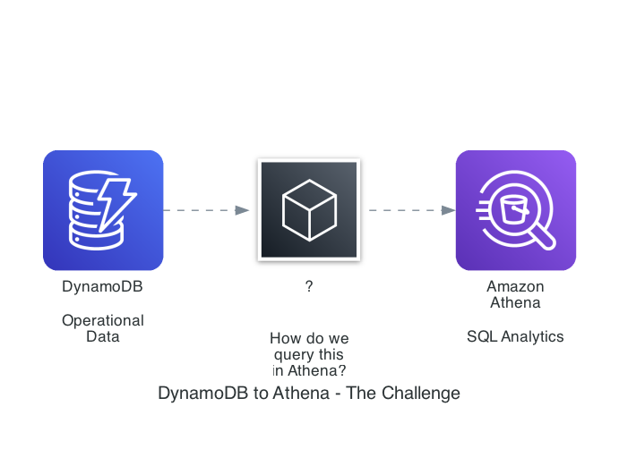
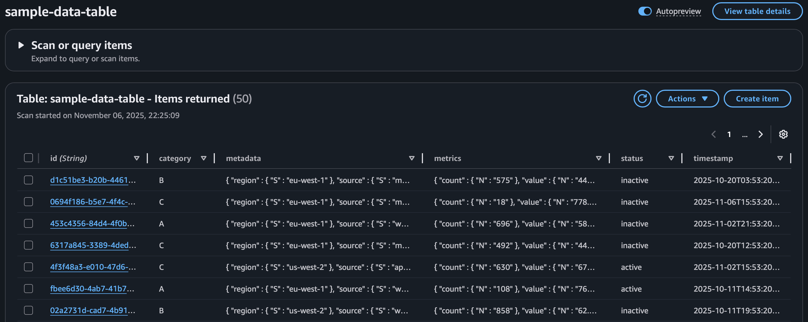
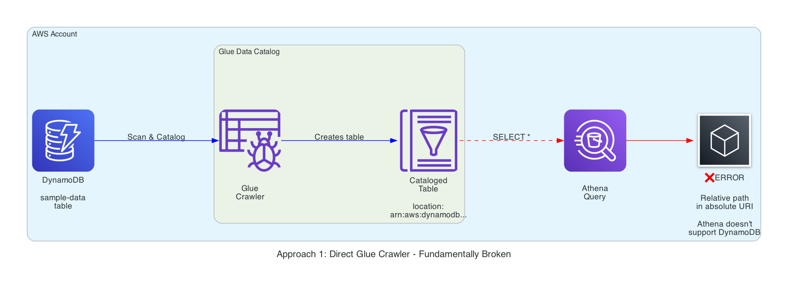
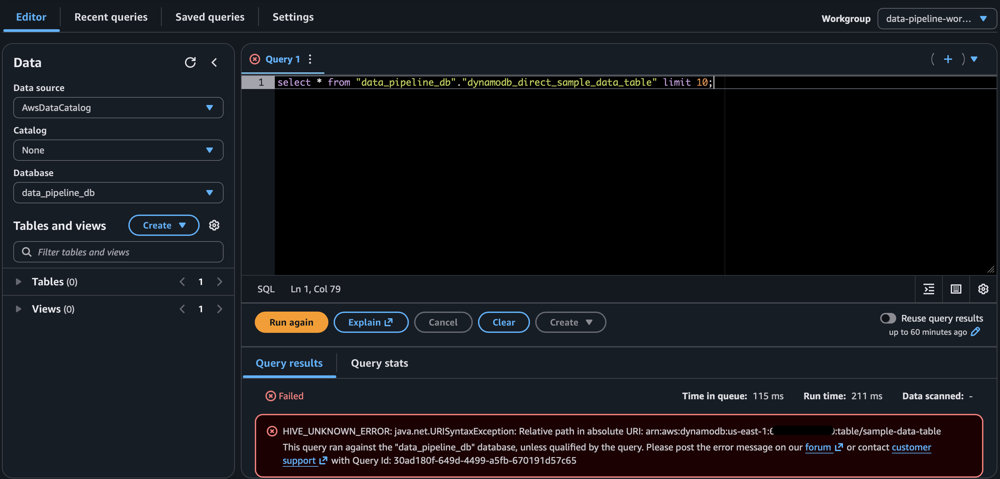
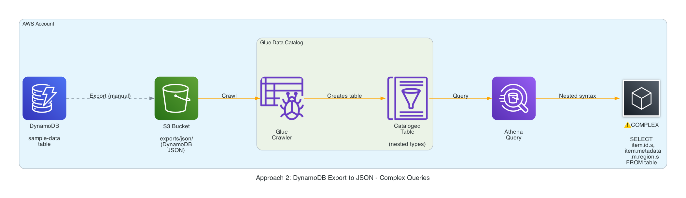
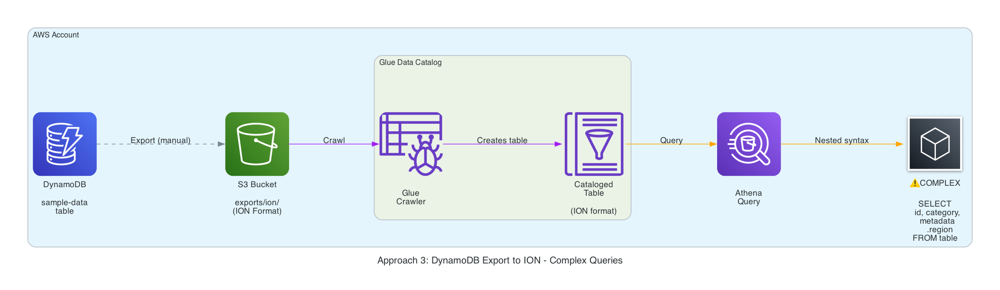
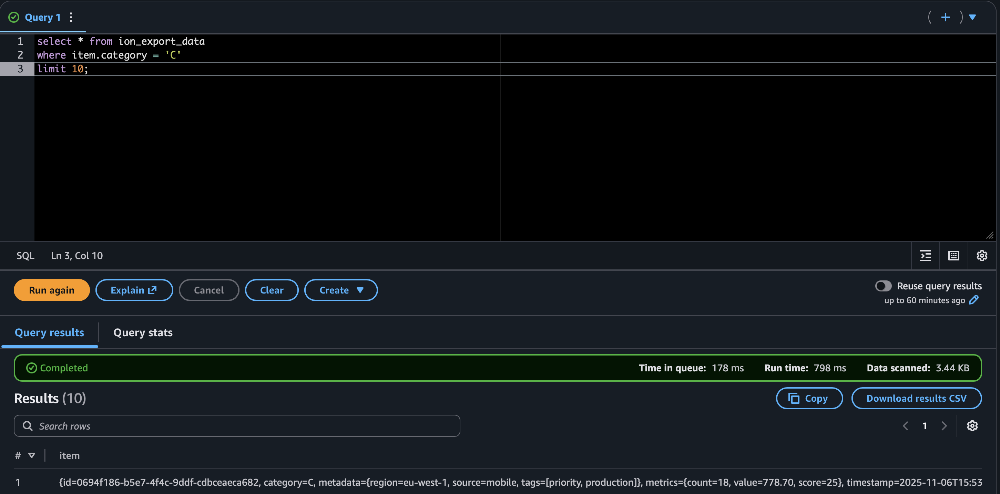
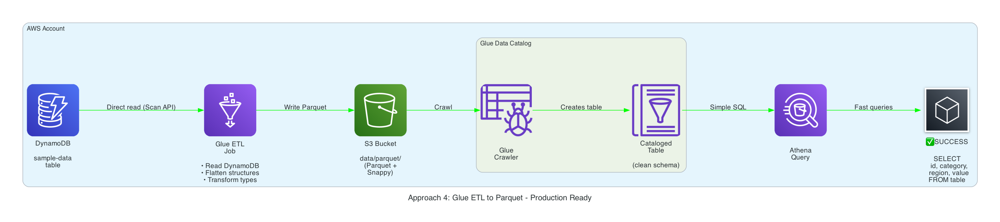
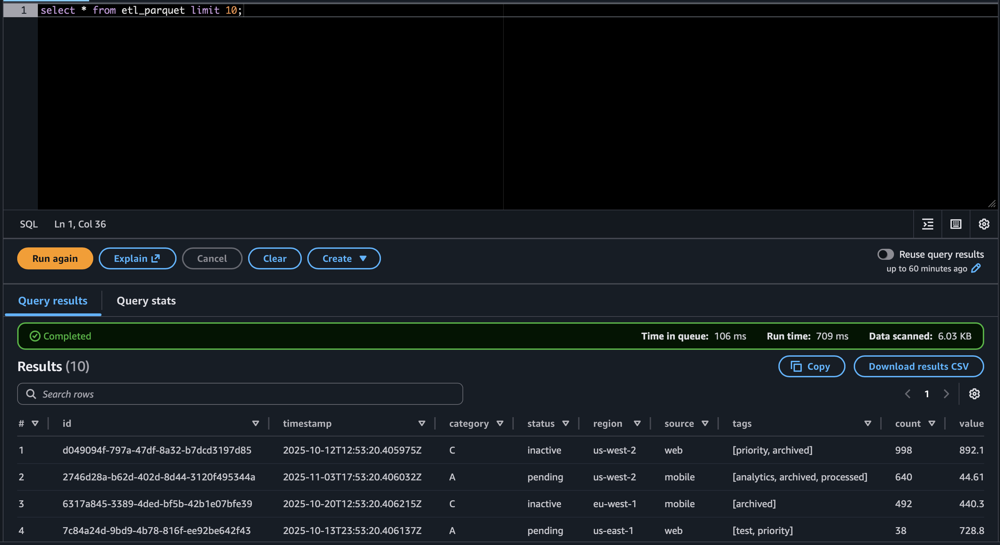

+++
title = "Querying DynamoDB data in Athena without losing your mind"
description = "I tried four approaches (and mostly failed) before landing on a Glue ETL + Parquet pipeline that finally made DynamoDB work cleanly with Athena."
summary = "Glue crawler on DynamoDB? Nope. DynamoDB export JSON? ION? Painful. Here’s the path I took — with CDK stacks and screenshots — to land on a reliable ETL workflow."
date = 2025-11-07
categories = ["AWS", "DynamoDB", "Athena", "Glue", "CDK", "Data Engineering"]
tags = ["dynamodb", "athena", "glue", "etl", "parquet", "ion", "json", "aws-cdk"]
feature = "featured.png"
layout = "simple"
draft = false
+++


## The Why 🤔

I was helping out someone this week to get snapshot visibility into a DynamoDB table via Athena. The plan was: “catalog the table, run a query, call it a day.” Instead I bounced between four approaches, each failing in slightly different (and educational) ways before landing on a Glue ETL job that emits Parquet. If you’re trying to follow a similar breadcrumb trail, here’s the full map — dead ends included.

## Architecture at a glance



- `DataStack` is the shared foundation: DynamoDB table (PITR on), S3 bucket with lifecycle rules, Glue database, Athena workgroup (`recursiveDeleteOption: true` so teardown doesn’t get stuck), and a Python data seeder Lambda for mock data.
- Each failure path is isolated in its own CDK stack so I can `cdk deploy ExportJsonStack`, or tear it down without touching the others.
- Source is under `bin/` + `lib/stacks/`, with helper code in `resources/` for the seeder and Glue ETL script.

The code is available in my example repository - [weirdion/dynamodb-glueetl-athena-cdk-example](https://github.com/weirdion/dynamodb-glueetl-athena-cdk-example/)

Dyanmo DB sample data, to mock real life entries, not just simple strings and numbers.


## Approach 1 — Glue crawler pointed directly at DynamoDB (fails fast)



```ts
// lib/stacks/crawler-dynamodb-stack.ts (excerpt)
this.crawler = new CfnCrawler(this, 'DynamoDbDirectCrawler', {
  name: 'dynamodb-direct-crawler',
  targets: { dynamoDbTargets: [{ path: props.tableName }] },
  databaseName: props.databaseName,
  tablePrefix: 'dynamodb_direct_',
});
```

- Glue happily catalogs the table and publishes a schema, so it _looks_ like success.
- Athena immediately errors because only DynamoDB tables are not supported.
- Lesson: a Glue Catalog entry doesn’t guarantee Athena compatibility. Catalog ≠ queryable.




## Approach 2 — DynamoDB export → JSON → Glue crawler (technically works, practically awful)



```bash
aws dynamodb export-table-to-point-in-time \
  --table-arn $TABLE_ARN \
  --s3-bucket $BUCKET \
  --s3-prefix exports/json/ \
  --export-format DYNAMODB_JSON
```

- Exports **DO NOT** land quickly, even for a small mock data set, had wait several minutes.
- The crawler builds a table from S3 export, there's a lot of metadata file tables and every attribute carries type descriptors (`S`, `N`, `M`, etc.).
- Filtering by category becomes `SELECT * FROM json_export_sample_data_table WHERE category.s = 'B';`. Joining on nested structs is even worse (`metadata.m.region.s`).
- You _can_ wrangle it (see screenshot), but asking teammates to read that kind of JSON is a non-starter.


## Approach 3 — DynamoDB export → ION (slightly nicer, still clunky)



```bash
aws dynamodb export-table-to-point-in-time \
  --table-arn $TABLE_ARN \
  --s3-bucket $BUCKET$ \
  --s3-prefix exports/ion/ \
  --export-format ION
```

- Again, exports **DO NOT** land quickly, even for a small mock data set, had wait several minutes.
- ION gave me hope because it preserves numeric fidelity and drops most of the `S/N/M` wrappers. Glue crawled the export and Athena _could_ query it.
- Unfortunately the rows still arrive as a single `item` struct (`item.metadata.region`, `item.metrics.count`, etc.). You can filter with `WHERE item.category = 'C'`, but joins still require nested selectors and manual casting.
- Compared to JSON it’s marginally more readable, yet I’d still have to maintain a view that flattens everything before handing it to analysts. At that point, I might as well run a proper transform.



## Approach 4 — Glue ETL → Parquet (finally usable)



```ts
// lib/stacks/etl-parquet-stack.ts (job excerpt)
this.etlJob = new CfnJob(this, 'DynamoDbToParquetJob', {
  name: 'dynamodb-to-parquet-etl',
  command: { name: 'glueetl', scriptLocation: scriptAsset.s3ObjectUrl },
  defaultArguments: {
    '--TABLE_NAME': props.tableName,
    '--OUTPUT_PATH': `s3://${props.bucketName}/data/parquet/`,
    '--DATABASE_NAME': props.databaseName,
  },
  workerType: 'G.1X',
  numberOfWorkers: 2,
});
```

```python
dynamodb_dyf = glueContext.create_dynamic_frame.from_options(
    connection_type="dynamodb",
    connection_options={
        "dynamodb.input.tableName": args['TABLE_NAME'],
        "dynamodb.throughput.read.percent": "0.5",  # Use 50% of table's read capacity
    }
)

# resources/glue/dynamodb-to-parquet-etl/job.py (flattening snippet)
flattened_df = df.select(
    col("id").cast(StringType()).alias("id"),
    col("category").cast(StringType()).alias("category"),
    col("metadata.region").cast(StringType()).alias("region"),
    col("metadata.source").cast(StringType()).alias("source"),
    col("metrics.value").cast(DoubleType()).alias("value"),
    col("metadata.tags").alias("tags"),
)
```

- Glue reads directly from DynamoDB (I cap `dynamodb.throughput.read.percent` at `0.5` so I don’t trash prod capacity), flattens the nested structs, and writes Snappy Parquet.
- A follow-up crawler over `s3://…/data/parquet/` produces a clean table (`etl_sample_data_table`) that behaves just like any other Athena dataset.
- Scan costs nosedive because Parquet is columnar, and everyone can finally write `SELECT region, COUNT(*) FROM parquet_sample_data_table GROUP BY 1;`.



The code is available in my example repository - [weirdion/dynamodb-glueetl-athena-cdk-example](https://github.com/weirdion/dynamodb-glueetl-athena-cdk-example/)

## Cost + operational notes

- **DynamoDB export**: free, PITR required, outputs only JSON/ION.
- **Glue crawler**: pennies, but it can’t make unsupported formats magically queryable.
- **Glue ETL**: 2 × G.1X workers (~$0.44/DPU-hour). Disable bookmarks for one-off demos; enable them for incremental loads.
- **Athena**: charged per TB scanned. Parquet brings the dataset small enough that test queries stay in the pennies.

## Don't forget to cleanup 🧹

```bash
cdk destroy --all
```

- The demo stacks use `RemovalPolicy.DESTROY` and `autoDeleteObjects` for convenience. Flip those to `RETAIN` + `blockPublicAccess` if you adapt this for anything long-lived.
